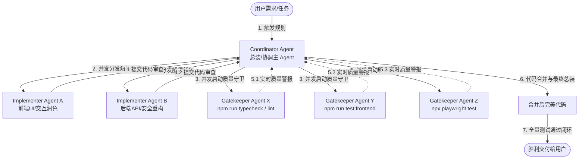

# InkFlow Repository Instructions

## Scope
- This file defines repository-local working rules for `/Users/Zhuanz/Documents/dodo-inkflow`.
- Keep machine-wide preferences in `~/.codex/AGENTS.md`.

## Workflow
- Start with read-only analysis when the project or requirement is unclear.
- Inspect the relevant code before editing and summarize the intended change.
- Keep diffs small, reviewable, and easy to roll back.
- Prefer one scoped task at a time instead of multi-feature rewrites.
- Preserve the existing React + TypeScript + Vite + Express + SQLite architecture unless there is a clear reason to change it.

## Karpathy Coding Guidelines
- Apply these guidelines by default when writing, reviewing, or refactoring code in this repository.
- Think before coding: state assumptions, surface ambiguity, and ask when a risky choice cannot be inferred.
- Prefer simplicity: implement only what was requested, avoid speculative features, and do not add abstractions for one-off code.
- Make surgical changes: touch only files and lines needed for the task, preserve existing style, and do not clean up unrelated code.
- Use goal-driven execution: define a verifiable success condition for non-trivial changes and loop until the relevant check passes or the blocker is clear.
- Every changed line should trace back to the user's request or to validation required by that request.

## Safety
- Do not modify secrets, shell profiles, system settings, SSH config, or Git remotes.
- Do not change migrations, infrastructure, deployment settings, or destructive scripts without explicit approval.
- Do not add dependencies without approval.
- Do not disable sandboxing, bypass approvals, or enable network access for this repository without explicit approval.

## Validation
- Add or update tests when behavior changes.
- Run the smallest relevant validation after edits.
- If project metadata is incomplete, inspect the repository and infer the real commands before making changes.

## Technical & Architectural Standards (技术与架构规范)
对于本项目（InkFlow）中涉及的任何功能迭代、漏洞修复和架构重构，必须严格遵守以下工程规范：

### 1. SQLite WAL 一致性快照备份规范
- **禁止直接物理拷贝**：当数据库启用 WAL 模式（`journal_mode = WAL`）时，绝对禁止在运行中直接调用物理文件拷贝、打包或通过 HTTP 接口下载 `data.db` 物理文件。因为最新数据极易滞留在 `data.db-wal` 临时日志中，直接导出物理文件不仅极易缺失用户最新的写作、设定内容，还可能在还原时引发严重的一致性错误或主库损坏。
- **强制使用原生备份 API**：必须统一通过 SQLite / `better-sqlite3` 原生提供的具有事务快照特性的 `db.backup(destination)` 接口生成一致性快照文件（如 `DB_PATH + '.temp-export'`），将快照导出至 HTTP 响应或暂存。
- **零残留垃圾清理**：在文件流传输完毕（或传输中途异常终止、下载失败）的回调钩子中，必须立即同步调用 `fs.unlinkSync` 进行物理抹除，保证宿主服务器不留下任何 `.temp` 后缀的磁盘垃圾。
- **降级容灾**：当数据库单例尚未完成初始化，无法调用 `db.backup` 时，方可优雅降级为直接物理传输，确保接口具备 100% 高可用弹性。

### 2. LLM 连接性与 API Key 状态的诚实容灾规范
- **杜绝乐观状态伪装**：系统加载 API Key 或网络检测失败时，严禁使用盲目乐观的硬编码回退（例如 `.catch(() => setHasApiKey(true))`），以此对用户隐藏或伪装密钥状态、避而不报。
- **三态标记与琥珀色降级**：必须在密钥状态定义中引入独立的 `'unknown'` 字面量（即：未配置 / 配置状态未知）。在检测发生网络波动、抛错、异常捕获（catch）时，统一标记为 `'unknown'`。
- **UI 显性与温和指引**：在欢迎页及状态栏等状态指示器中，针对 `'unknown'` 状态必须显式渲染琥珀色 `STATE_UNKNOWN` 视觉（而非绿色 `CONNECTED` 或普通报错红色）。且页面必须附有专属保底状态横幅，说明网络情况、提供温和且诚实的本地离线大纲和全流程降级写作指引。

### 3. 自适应工作流路由动作闭环规范
- **跨视图路由自适应深度追踪**：当用户在类似 ProjectCockpitView（项目驾驶舱）中点击具有特定意图的行动决策推荐（如“对本章进行审稿”或“一键精修局部润色”）时，跨视图跳转到 EditorView 后绝对不能仅仅做静态面板切换。
- **静默首发执行**：必须在 `launchState.source` 中通过拓展启动源（如：`'cockpit-audit'` 与 `'cockpit-polish'`）进行完整追踪。在 `EditorView` 组件和数据加载就绪后，直接静默触发核心动作方法（如自动调用深度审计 `handleRunAudit()` 或自动跑起润色 `handlePolishChapterFromAudit()`），减少不必要的重复人工点击，大幅缩短用户体验链路。

### 4. 多 Agent 并发协同开发与校验机制
对于所有的开发、优化与缺陷治理任务，必须默认引入多 Agent 并行开发和守卫模型。该模式通过明确的三角色定义、物理边界隔离以及并发反馈闭环，彻底实现高吞吐和高可靠性交付：

#### A. 三角色并发协同模型 (Three-Role Concurrency Model)
- **Coordinator Agent（总装/协调主 Agent）**：
  - 职责：理解原始需求，编写高精度的设计文档与实现计划（`implementation_plan.md`）。
  - 任务分配：根据物理边界将庞大任务切分为互不重叠的子任务（如前端与后端、UI 与逻辑），并发派发给 Implementer Agent。
  - 合并总装：在所有并发子任务完成后，主 Agent 统一在本地拉取、合并、编译，并拉起 Gatekeeper 进行终极总装。
- **Parallel Implementer Agents（并发实现子 Agent）**：
  - 职责：在绝对解耦的边界或临时 Workspace 中并行、独立地实现被指派的任务，并在完成后提交本地验证日志。
- **Gatekeeper Agents（并发质量守卫子 Agent）**：
  - 职责：无需串行等待，并发启动独立子 Agent 运行静态类型检查 (`npm run typecheck` / `lint`)、单元测试 (`npm test`)、端端测试 (`npx playwright test`)，将质量警报实时反哺给 Coordinator。

#### B. 并发冲突防御与安全隔离 (Concurrency & Safety Isolation)
- **解耦任务边界**：禁止指派多个 Implementer Agent 并发修改同一源文件。如有业务修改交集，由 Coordinator 负责在总装期统一编排和外科手术式手工合并。
- **SQLite 物理隔离测试**：任何并发运行的 Gatekeeper 测试（如 Vitest 单元测试与 Playwright 仿真）绝对禁止同时对运行中的 `data.db` 生产库执行物理写入。测试环境必须使用内存库（内存中的 `:memory:`）或独立的 `test.db`，确保高并发无死锁。
- **凭证与 Secrets 安全**：子 Agent 一律通过继承 `inherit` 模式安全读取主会话凭证，禁止在子 Agent 的命令行中硬编码明文密钥。
- **资源与耗尽防护**：主 Agent 调用的脚本、或自动化测试命令中设置合理的超时阈值（如 Playwright 设定单例超时为 10s-15s，Vitest 启用并发池限额）。

## Output
- Communicate in Chinese unless the user explicitly asks otherwise.
- For non-trivial changes, report:
  1. Summary of changes
  2. Files changed
  3. Validation performed
  4. Risks or follow-up work
