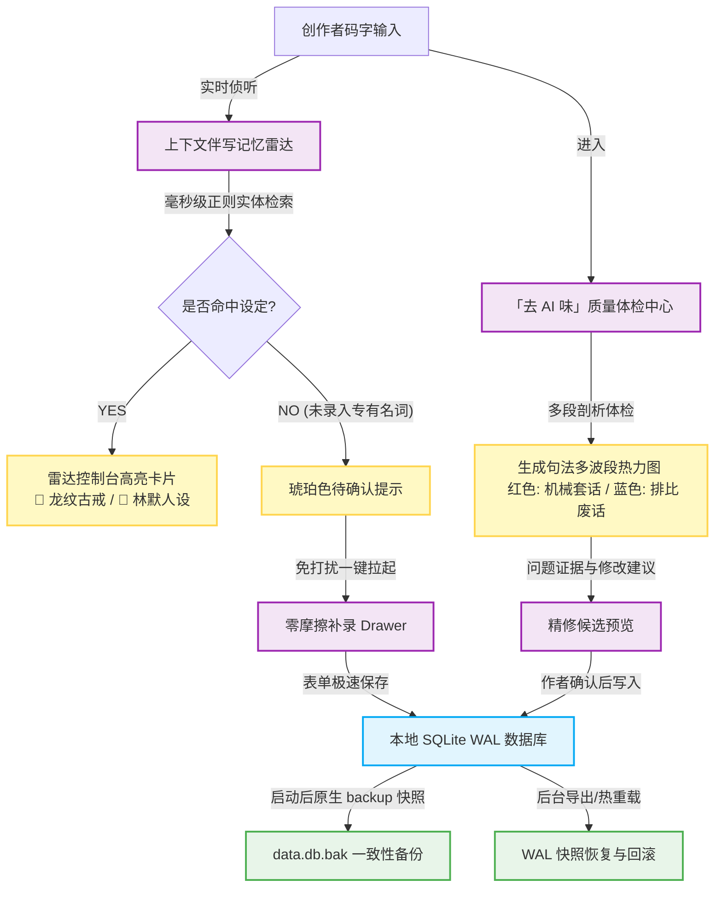

<div align="center">

</div>
# InkFlow 墨影 — 受治理的本地优先 AI 写作助手

<p align="center">
  
  
  
  
</p>

**InkFlow 墨影是一款面向小说作者的本地优先 AI 写作助手：AI 提议，你裁决，创作数据默认保存在本机。**

在传统写作软件中，创作者常面临：*AI 生成废话连篇、行文翻译腔过重、写到后面人设与法则崩塌、断网无法使用以及随时丢稿*的阵痛。

墨影通过本地 SQLite/WAL 数据保护、开书向导、能力卡、故事记忆、审稿与精修预览，帮助作者完成从灵感到正文的连续创作。AI 生成的设定、大纲、事实和精修内容先作为候选展示；只有作者明确确认后，才写入作品 Canon 或正文。

> 当前产品定位以本 README 为准。`PRD.md` 中的“全自动工厂 / Agent Souls”和 `PRD_V2.md` 中的“Cortex”是历史愿景或内部代号，不代表当前 Beta 的交付承诺。

## 当前状态

| 验证日期 | 当前能力 | 当前限制 |
|----------|----------|----------|
| 2026-08-17 | 本地作品、设定和章节编辑；受治理的设定/大纲/正文候选；SQLite/WAL 原生 `backup()` 一致性快照；AI 失败恢复与本地降级写作；Beta 默认开放增强能力 | AI 功能依赖用户配置外部 API Key 和可用网络；当前没有真实支付、订单或订阅系统；签名、真实 Provider 和其他平台需发布环境复核 |

InkFlow 不是完全离线的 AI 工具：没有外部模型连接时，本地编辑、设定管理和备份仍可用，模型生成会明确显示不可用原因。

### Beta 权益边界

- 当前默认关闭商业化门禁，不提供在线购买，也不提供或读取本地激活码会员状态。
- 本地写作、数据管理和用户自带 API Key（BYOK）的基础 AI 主链属于基础能力；增强工作流和授权技能在 Beta 默认开放。
- 商业化实验开启后，增强能力只认服务端作品权益；浏览器本地访问码或客户端自报状态不能解锁权益。
- 未来如提供托管模型额度，将与 BYOK 分开计量；高级工作流、授权资产、跨章连续性和批量审稿可作为 Pro 候选，但尚未形成价格或售卖承诺。
- 商业化实验要求前后端开关同时显式启用。完整边界见 [权益与商业化边界](docs/monetization-boundary.md)。

---

## 下载与安装

### macOS

1. 从 [Releases](https://github.com/653390665/dodo/releases) 或 [Actions](https://github.com/653390665/dodo/actions) 下载 `InkFlow-*-mac-arm64.dmg`
2. 双击 `.dmg` 文件挂载
3. 将 `InkFlow.app` 拖入 `Applications` 文件夹
4. **重要**：首次打开时，macOS 会提示"无法验证开发者"
   - 打开 **系统设置 → 隐私与安全性**
   - 找到 "InkFlow" 并点击 **"仍要打开"**
   - 或右键点击 `InkFlow.app` → 选 **"打开"** → 再点 **"打开"**
   - **极客方案**：直接在终端运行 `sudo xattr -cr /Applications/InkFlow.app` 一键抹除未签名隔离属性。
5. 之后正常双击即可启动

### Windows

1. 从 [Releases](https://github.com/653390665/dodo/releases) 或 [Actions](https://github.com/653390665/dodo/actions) 下载 `InkFlow-*-win-x64.exe`
2. 双击运行安装程序
3. 选择安装路径（默认或自定义均可）
4. 勾选"创建桌面快捷方式"
5. 安装完成后从桌面或开始菜单启动

> **Windows 注意**：杀毒软件可能误报拦截，选择"仍要运行"即可。本项目代码完全开源，可自行审查。

---

## 墨影核心工作流



## 核心能力

传统 AI 写作工具往往只是简单的“一问一答”式对话，极易打断创作者极度珍贵的心流状态。墨影通过前/后端架构的深度闭环设计，在本地彻底终结这些阵痛：

### 能力 1：「去 AI 味」审稿与精修预览
*   **痛点**：普通 AI 续写出来的句子翻译腔重、机械感强、充满了高频的排比句和心理情绪废话，一眼即知是 AI 笔墨。
*   **处理方式**：审稿结果保留证据和问题定位；精修先生成可比较的预览，作者确认后才写入正文，并保留修改前版本。

### 能力 2：故事记忆与关系图谱
*   **痛点**：写长篇时主角人设、地点法则、神兵道具设定庞杂，作者需要频繁切屏翻阅大纲，严重割裂码字状态。
*   **处理方式**：编辑器按正文命中人物、地点、道具和关系，并展示可核对的作品记忆；未录入实体停留在候选或补录入口，不会自动改写设定。

### 能力 3：本地数据与一致性 WAL 快照
*   **痛点**：市面写作工具随时断电丢稿；若开启云端同步，大纲人设等核心商业机密面临泄露和被洗劫的风险。
*   **边界**：墨影坚持本地优先，正文、设定和配置默认保存在本机；AI 生成仍需要用户提供可用的外部模型服务。备份和导出统一使用 SQLite 原生 `db.backup` 快照，避免直接拷贝 WAL 主库文件。

---

## 首次配置（必读）

InkFlow 本身不内置 AI Key，你需要配置自己的大模型 API。未配置或网络未知时，仍可使用本地编辑、设定和数据备份功能；AI 生成会明确显示不可用原因。

### 1. 获取 API Key

| 服务商 | 获取地址 | 备注 |
|--------|----------|------|
| Google Gemini | https://aistudio.google.com | 推荐，支持 Thinking 深度推理 |
| DeepSeek | https://platform.deepseek.com/api_keys | |
| MiniMax | https://platform.minimaxi.com | |
| OpenAI | https://platform.openai.com/api-keys | |
| 其他兼容接口 | 各服务商官网 | |

### 2. 在 InkFlow 中配置

#### 方案 A：使用 Google Gemini 原生渠道（推荐）
1. 启动 InkFlow，点击设置。
2. 填入你的 **Gemini API Key**。
3. **Base URL** 留空，或者填入 Google 官方地址 `https://generativelanguage.googleapis.com`。
4. **Model** 填入 `gemini-2.5-pro` 或 `gemini-2.5-flash`。系统会自动识别并开启 Thinking Mode（深度思考模式）。

#### 方案 B：使用 OpenAI 兼容接口规范的大模型服务
1. 启动 InkFlow，点击设置。
2. 填入：
   - **API Key**：你的密钥
   - **Base URL**：API 地址（如 `https://api.deepseek.com/v1`）
   - **Model**：模型名称（如 `deepseek-chat`、`MiniMax-M2.7`）
4. 点击保存，配置会存储在本地 `~/.inkflow/config.json`

> 配置好之后，"开始创作"页面才能正常调用 AI 生成故事方案卡。

---

## 快速上手

### 第一步：灵感与开书多步向导 (Interactive Welcome Assistant)

打开 InkFlow 后默认进入 **"开始创作"** 页面。新版为您提供了极具沉浸感的多步卡片式向导（题材问答 ➔ 平台定位（番茄/阅文/Lofter等）➔ 篇幅规划 ➔ 风格偏好）。通过点击精美的 Hover 选项或输入自己的一句话灵感，AI 将深度结合平台属性与篇幅偏好（如轻松幽默、高能爽快），为您智能生成 3 张高度契合的长线故事方案卡。

### 第二步：世界搭建

选择一张故事卡后进入 **"世界搭建"** ——系统会自动生成设定任务（角色、世界观、大纲等），支持一键装载行业大神的定制流程模板，让世界设定井然有序。

### 第三步：进入创作舞台

设定完成后进入 **"创作舞台"**：
- **左侧**：章节列表，可以增删改章节，具有字数实时追踪与防抖自动保存。
- **中间**：极简高配写作面板，直接码字，今日进度与连续字数常态化展示。
- **右侧**：AI 智慧控制台：包括**上下文记忆雷达伴写**、**零摩擦设定补录 Drawer**、以及全新的**质量体检中心（Quality Guard）**。

### 核心功能一览

| 功能 | 入口 | 说明 |
|------|------|------|
| 开始创作 | 侧边栏 → 开始创作 | AI 生成 3 张故事方案卡，一键创建作品（集成沉浸式多步卡片向导） |
| 我的书库 | 侧边栏 → 我的书库 | 管理所有作品，导出 TXT/EPUB 格式 |
| 创作舞台 | 打开作品后 | 左右分栏：左侧极简高配编辑器 + 右侧智慧控制台，AI 实时辅助 |
| 设定记忆 | 创作舞台右侧 | 人物档案、地点、道具、势力、境界、时间线等，支持智能文件识别分类 |
| 资料续写 | 创作舞台 → 资料续写 | 拖拽文件夹或 zip 导入背景资料，安全沙箱智能解析并深度注入章节生产 |
| 能力商店 | 侧边栏 → 能力商店 → 我的技能 / 能力商店 | 按流程、技法、能力卡、审稿卡、工具和护栏管理；作品默认、本章使用和单次运行分开 |
| 拆书工厂 | 侧边栏 → 拆书工厂 | 上传范文，AI 拆解文风技能卡（主笔卡 + 副卡组） |
| 我的技能 | 能力商店 → 我的技能 | 查看和管理已保存的拆书技能卡，按角色装配到作品 |
| 灵感助手 | 侧边栏 → 灵感助手 | AI 自由对话，辅助构思、头脑风暴并突破瓶颈 |

### 资料续写怎么用？

1. 打开任意作品，在创作舞台右侧面板切换到 **"资料续写"** 标签
2. **极速上传**：不仅支持常规的单文件（.txt/.md/.json/.docx）上传，更支持直接**拖拽整个文件夹**或**一键导入 .zip 压缩包**！
3. **安全沙箱与智能去重**：自动过滤 `.DS_Store`、`__MACOSX` 等系统垃圾，并基于文件名和大小对多级子目录文件进行前端智能去重，提供零阻碍的队列管理。
4. **解析与调优**：点击"解析资料包"，AI 自动提取硬设定事实、人物状态、剧情位置，支持点击删除不慎拖入的单个文档。
5. **确认并启用**：审阅解析结果后明确确认；已确认资料会成为后续章节生产的可追溯上下文来源。

### 设定记忆怎么用？

1. 打开作品后，创作舞台右侧默认显示 **设定记忆**（7 个 tab）
2. **全局设定**：编辑故事大纲和世界观法则
3. **人物档案**：添加角色，AI 可自动生成详细背景故事
4. **地点/道具/势力/境界**：分类管理世界设定
5. **纪元与时间线**：可视化时间节点，拖拽排序
6. 支持智能导入设定文档（.txt/.md/.json/.docx），AI 自动解析并分类

### 能力商店（Skills Studio）怎么用？

1. 点击侧边栏中的 **"能力商店"**，默认进入 **"我的技能"**，也可切换到能力商店货架。
2. **白标内容治理**：公共能力卡在进入目录前执行敏感标识和品牌信息清理；具体规则由本地治理测试约束，不承诺绝对无遗漏。
3. **按作用域使用能力**：流程和能力卡用于作品默认配置；正文技法可选择“全文统一”或“用于本章”；审稿卡、精修卡和工具默认“仅运行一次”，护栏保存为系统检查候选后参与生成与审稿。

### 质量体检中心（Quality Guard）怎么用？

1. 在创作舞台右侧 AI 智慧控制台中，切换到 **"质量中心"** 标签。
2. **全方位打磨**：集成了一键去 AI 味、审稿、动作链补强、对白打磨和节奏检测。
3. **句法波段热力图**：点击“开始质量体检”，系统将对当前章节内容进行深度剖析。生成高颜值的段落多波段热力图，使用不同颜色直观标注出“机械翻译套话”或“心理排比废话”，并给出客观的去 AI 味体检评分。
4. **精修候选**：生成修改预览并对比原文；确认后才应用到正文，修改前版本可用于回退。

### 上下文伴写雷达（Memory Radar）怎么用？

1. 只要你在主编辑器中码字，或者将光标移到某个段落，右侧的 **“记忆雷达”** 挂件就会自动激活。
2. **旋转呼吸脉冲**：面板顶部呈现科技感十足的多重光环旋转呼吸动效，象征 AI 正在高频检索文本。
3. **专有名词匹配**：当检测到文本中包含特定的主角名（如“林啸”）、神器（如“龙纹古戒”）时，雷达会自动在下方高亮弹出该实体的完整背景、人设或道具参数，实现真正意义上的“写到哪，设定跟到哪”。
4. **零摩擦免打扰补录**：如果检测到新出现且未录入的角色或地点，雷达下方会闪烁琥珀色提示并显示 “一键补充到设定库”。点击后，会在右侧无缝展开一个轻量级补录 Drawer。你可以在不打断主编辑器输入的情况下快速填入设定，彻底告别写书中断。

### 拆书工厂怎么用？

1. 打开拆书工厂
2. 粘贴你喜欢的小说的章节文本（或上传 TXT 文件）
3. 点击"开始拆书与萃取 Skill"
4. AI 会分析文风、人物、剧情套路，生成 **主笔卡 + 副卡组**
5. 点击"保存整组 Deck"存储到能力商店的“我的技能”
6. 在创作舞台中装备这套卡组，AI 生成时会模仿这个文风

### 章节生产怎么用？

1. 在创作舞台中，点右上角 AI 面板按钮
2. 切换到 **"自动生产"** 标签
3. 输入创作意图（如"这一章要写主角在雨夜酒馆试探掌柜"）
4. 点击"开始生产一章"
5. AI 会自动生成分镜 → 正文 → 文风审计 → 连续性报告
6. 审阅后点击"接受并写入"完成到章节列表

---

## 其他特性

- **极致暗色模式**：设置 → 外观 → 亮色/暗色切换，自动记忆偏好，提供极致护眼的黑金色调墨水风格。
- **启动自动冷备份**：完成数据库 schema 初始化后，应用使用 SQLite 原生 `backup()` 生成一致性快照 (`data.db.bak`)，避免直接拷贝 WAL 主库造成不完整备份。
- **一键热恢复与回滚**：设置中心配备全新数据管理（Data Management）控制台，支持导出当前的通过 WAL 快照生成的一致性 SQLite 数据备份包，以及在极速热覆盖模式下一键恢复、回滚并整页热更新。
- **智能驾驶舱行动推荐**：仪表盘不再展现死板的六宫格，而是根据“缺失首章 -> 设定不足 -> 缺乏分镜 -> 缺乏正文 -> 审计缺陷 -> 润色备份”这一故事孕育生命周期，由专属算法动态渲染出当前最需要的 3 项行动，并将第 1 项卡片通过高饱和度主题渐变亮起（Primary 状态），支持点击直接一键自适应路由跳转到编辑器并执行关联动作。
- **诚实网络容灾与琥珀色降级**：加载 API 密钥或发生网络波动时杜绝盲目乐观掩盖，当遇到网络异常、未配置或捕获抛错时统一标记为 `'unknown'`，并在状态指示器渲染专属琥珀色状态；本地编辑、保存和设定整理可继续，模型生成需恢复 API Key 与网络。
- **键盘快捷键**：全局 `Cmd/Ctrl+K` 搜索，编辑器支持 `Cmd/Ctrl+Z` 撤销 / `Cmd/Ctrl+Shift+Z` 重做，进入无打扰沉浸式码字。
- **自动保存**：编辑器内容 3 秒防抖自动保存，关闭前未保存提醒。
- **字数追踪**：编辑器顶部栏实时显示字数和今日进度，让自律清晰可见。
- **分割面板**：创作舞台左右分栏可拖拽调整比例，小屏自动切换单栏。

## 常见问题

**Q: 生成卡住不动？**
A: AI 模型响应可能较慢（尤其是 MiniMax M2.7 等推理模型），最长等待约 2 分钟。如果超时报错，缩短输入文本后重试。

**Q: 数据存在哪里？**
A: 所有数据存在本地 `~/.inkflow/` 目录下，包括数据库和配置文件。换个设备需要重新配置 API Key。

**Q: 能换模型吗？**
A: 可以。设置页面随时修改 Base URL 和 Model，只要是 OpenAI 兼容接口就行。

**Q: 能导出小说吗？**
A: 能。创作舞台底部状态栏有导出按钮，支持 TXT 和 EPUB 格式。

**Q: macOS 提示"无法验证开发者"？**
A: 应用未签名（需 Apple Developer 账号，$99/年）。你可以右键点击 App → 打开 → 确认，或者在终端运行 `sudo xattr -cr /Applications/InkFlow.app` 物理抹除系统的隔离标识。

**Q: Windows 杀毒软件拦截？**
A: 选择"仍要运行"。代码开源可自行审查。如需彻底消除误报，需购买代码签名证书。

---

## 开发者

### 本地运行

```bash
# 环境要求 Node.js 22+
npm install
cp .env.example .env.local   # 编辑填入 API Key

# 1. 仅启动 Web 端服务（在浏览器中调试）
npm run dev                  # 启动开发服务器，打开 http://localhost:3000

# 2. 启动 Electron 桌面开发端（自愈式启动底座）
npm run electron:dev         # 自动执行静默编译，排除 ELECTRON_RUN_AS_NODE 变量污染，一键拉起桌面并挂载 DevTools 调试面板
```

### 打包桌面应用

```bash
npm run package    # 打包当前平台（macOS → DMG，Windows → EXE）
```

### CI 自动构建

push 到 main 分支后，GitHub Actions 自动构建 macOS + Windows 安装包。产物在 [Actions](https://github.com/653390665/dodo/actions) 页面下载。
