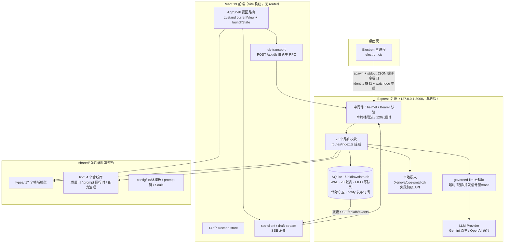
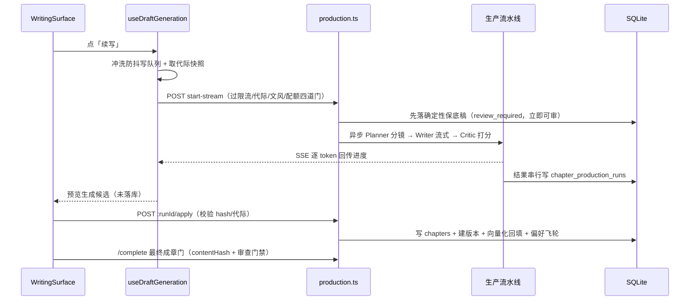

# InkFlow 架构图谱

> 生成于 2026-09-19，基于三个只读探索代理对 server/、src/、shared/ 的全量深读，所有结论带 file:line 锚点。
> 用途：新会话/新协作者的架构入门底图；后续重大重构前对照检查。
> 复核于 2026-09-23（HEAD `51954f2`）：路由注册 23 个（`routes/index.ts`）+ chapter-completion 单独在 `server.ts` 注册；测试文件数已增长；plan261 知识谱系尚未进本图。数字会继续漂移，涉及计数的结论以复核日为准。

## 一句话总览

InkFlow 是一个**本地优先的 AI 协作小说写作工具**：Electron 壳内嵌单进程 Express + SQLite，前端 React 无路由库、纯 zustand 状态驱动视图；核心设计哲学是「**AI 提议，你裁决**」——AI 的所有产出（草稿、设定、大纲）都先以"候选"存在，作者确认后才写入 Canon（正典）。

## 高层架构图

## 分层图谱

### ① 桌面壳与进程模型

- `electron.cjs:395-422` 孵化后端：dev 跑 `tsx server.ts`，prod 用 `ELECTRON_RUN_AS_NODE` 跑打包产物 `dist-electron/server.cjs`；注入 `INKFLOW_STATIC_DIR` / `INKFLOW_ELECTRON_MODE` / `INKFLOW_SECURE_API_KEY` / `PORT`。
- `electron.cjs:427-435` 从子进程 stdout 读 `{"port":n}` 握手；`:361-381` 用 identity token 探测 `/api/identity` 确认端口未被抢占；`:453-475,490` 子进程退出自动重启 + watchdog。
- 后端 `server.ts:44,144,154` 只监听 `127.0.0.1`，默认 3000，端口冲突递增重试至 +50；`server.ts:165-201` 致命错误排空写队列后 exit(1) 交由 Electron 重启。

### ② 后端（server/）

- **认证**：`middleware/auth.ts:7-46` 本机令牌文件 `~/.inkflow/.auth-token`（0600，64hex）；`:128-152` timingSafeEqual 校验 Bearer；SSE 事件流单独用 5 分钟 TTL 短期 query token（`:9-11,98-126`）；dev token 端点仅 loopback 且需 opt-in（`server.ts:89-100`）。
- **限流/超时**：`middleware/rate-limit.ts:8` 进程内令牌桶（0.2 tok/s，桶 5）按 endpoint 限 LLM 路由；全局 120s 超时（`lib/request-timeout.ts:6-21`）。
- **路由**（`routes/index.ts:32-56` 挂载 23 个注册器）：核心模块——`db.ts`（`POST /api/db` 白名单 RPC + SSE 变更推送 + 导入导出）、`production.ts`（章节生产 run：start/start-stream/:runId/apply）、`agents.ts`（inspiration/editor-agent/orchestrate job）、`continuation.ts`（续写包 job 化导入）、`audit.ts`（异步审稿+rewrite）、`skills.ts`（能力卡萃取+消毒）、`config.ts`（LLM 配置，API key 加密）、`export.ts`（EPUB/TXT）、`search.ts`（本地向量检索）、`simple-llm.ts`（SSE 扩写）。
- **LLM 集成**：`lib/server-llm.ts:769-788,966` 双 provider（baseUrl 含 googleapis → `@google/genai` 原生流；否则 OpenAI 兼容 `/chat/completions`，deepseek/minimax 特判）；统一 `ProviderError` 分类（`:58-146`）。配置存 `~/.inkflow/config.json`，dev 下 AES-256-GCM 加密，Electron 下走 `INKFLOW_SECURE_API_KEY`（`lib/config.ts:27-54,192-227`）。所有调用经 `helpers/governed-llm.ts:23-45` 治理（超时/配额/并发信号量/trace，`llm-execution-gate.ts`）。
- **Prompt 来源**：`shared/config/prompt-templates.ts`（用户可改，合并于 `config.ts:215`）+ `souls.ts` + `prompt-chains.ts`；`shared/lib/prompt-runtime.ts:36` 按 surface→stage 选模板。

### ③ 数据层

- `lib/db-init.ts:152-156,219-237` better-sqlite3 打开 `~/.inkflow/data.db`（`INKFLOW_DB_PATH` 可覆盖），WAL + foreign_keys + busy_timeout。
- `lib/db-instance.ts`：单例 + FIFO WriteQueue 串行化异步写（`:52-149`）+ `databaseGeneration` 代际防串台（`:20,141-149`）+ `notify()` 发布订阅。
- 约 28 张表（`db-init.ts:254-656`）：novels、characters、locations、items、factions、timeline_events、chapters、chapter_versions、chapter_completion_attempts、skills、skill_usage_records、foreshadowings、chapter_production_runs(+_versions)、continuation_packs、continuation_extraction_jobs、outline_artifacts、creative_artifact_*、creation_flow_sessions、canon_patches、vector_chunks、entity_relationships、product_events。
- **嵌入/向量**：`embedding.ts:124-128,165-217` 本地 `@huggingface/transformers` 跑 `Xenova/bge-small-zh-v1.5`（512 维 q8），失败降级 LLM `/embeddings` API；`vector-store.ts:100-148` JSON 向量存 `vector_chunks`，全表扫描余弦检索，按 modelId+维度过滤。

### ④ 共享契约层（shared/）

- `types/`：17 组领域模型——`novel.ts`（Novel/Chapter/ChapterVersion/ChapterProductionRun/ReviewState）、`world.ts`（Character/Location/Item/Faction/TimelineEvent/Foreshadowing/StoryStateLedger/EntityRelationship）、`creative-artifacts.ts`（OutlineNode/StructuredOutlineCore/ArtifactCandidate 三态）、`skills.ts`（Skill 六维+进化谱系）、`capability-manifest.ts`（CapabilityManifestEntry，scope=project|chapter|single-run|system；执行三阶段 planner|writer|critic）、`continuation.ts`（ContinuationPack + ContextReceipt 溯源）、`prompt-assets-governed.ts`（GovernedPromptAsset 消毒状态机）。
- `lib/` 54 个管线库分四组：**章节生产管线**（chapter-production、chapter-workflow、quality-gates 三层防御、quality-contract P0-P2 分级、draft-quality、review-issues）；**提示词运行时**（prompt-runtime、prompt-assets(-governed)、prompt-sanitizer 水印物理抹除、prompt-stage-routing、prompt-governance-catalog）；**能力治理**（capability-composition 冲突检测、capability-manifest-catalog、capability-recommendation、curated-product-skills 白标精选卡、public-skill-catalog 脱敏目录）；**续写包/解构**（continuation-pack、continuation-pack-parse、continuation-import-flow、continuation-zip、deconstruction-scoring）。
- `config/`：genre-profiles（网文类型约束）、prompt-chains（预规划→正文执行→终审三链）、prompt-templates、souls（Agent 人格如 PLANNER_SOUL）。

### ⑤ 前端（src/）

- **视图路由**：无 router 库。`AppShell.tsx:1259-1525` 按 `useAppStore.currentView`（9 个 ViewType，`shared/types/core.ts:142`）条件渲染全部 lazy 视图；`localStorage` 恢复上次视图（`stores/app-store.ts:84-99`）。
- **launchState 跨视图路由**（`stores/novel-store.ts:57-77`）：`continuationLaunchState`（→EditorView，AppShell.tsx:481-542）、`capabilityLaunchState`（能力卡→编辑器执行，:544-559）、`worldCapabilityLaunch`（→WorldBible，:628-632）；目标视图消费后 launchToken 清除；带意图的驾驶舱动作数据就绪后静默自动执行（见 docs/specs/cockpit-routing.md）。
- **主要视图**：WelcomeView（创意卡冷启动）、Library（书库）、EditorView（章节写作主链路，2826 行编排层）、ProjectCockpitView（驾驶舱）、WorldBibleView（世界观设定集）、SkillsStudioView（能力卡工坊）、BookFactoryView（拆书工厂）、ContinuationImportView（续写资料导入）、AgentWorkspace（编辑器内停靠智能管家）。
- **状态**：14 个 zustand store 按域拆分（app/novel/editor-data/editor-generation/production/user-intent/continuation-pack/outline-content/writing-style/assistant-session/skills-*）。
- **API 客户端**：`lib/db-transport.ts:64-77` 所有 CRUD 打成 `POST /api/db {method,args,databaseGeneration}`，响应头代际校验（`:13-38`）；SSE 变更推送本客户端回声忽略 + 500ms trailing 合并防刷新风暴（`:107-191`）。`main.tsx:11-18` 全局替换 `window.fetch`，`authenticated-fetch.ts:14-46` 对同源 `/api/*` 注入 Bearer（Electron 用 `window.inkflow.getAuthToken`，dev 自动 bootstrap）。
- **流式**：`sse-client.ts` 手写 SSE 解析（SseError 带 code/traceId）；`draft-stream.ts:19-45` 消费 status/token/done/source 且必须收到 done；`character-bio-stream.ts:41-99` 节流预览+仅提交最终值。
- **Worker**：`workers/continuation-zip.worker.ts` Web Worker 解压续写 zip。

## 关键运转链路

### 链路 1：章节生产主链路（核心业务）

要点：`production.ts:585` zod 校验 → `:587` 限流 → `:661-705` 代际/作品/文风指纹/章节归属校验 → `:708` 配额预占 → `:722-734` `initializeProductionRun` 落 run 行 → `:770` 开 SSE → `:784-816` Phase1 确定性保底 beats+草稿+质量门，`:872-885` 串行写库 `review_required` → Phase2 `runProductionPipeline`（`helpers/ai-production-pipeline.ts:222+`，Planner→Writer→Critic 低分重试）→ `:1109-1131` 模型结果串行写 → `done`。apply 在 `:1401,1601-1670`（scope/代际/版本 hash/保底源校验后 updateChapter + createChapterVersion + 偏好飞轮）。最终成章门 `helpers/chapter-completion.ts:148+`（contentHash/reviewState/门禁推导/attempt 阶段机）。

编辑器快速通道：WritingSurface → `useDraftGeneration.handleGenerateContent` → 冲洗 `editor-write-queue` + 代际快照 → `POST /api/orchestrate-draft`（useDraftGeneration.ts:286-301）→ `readDraftStream` 逐 token 预览（:334-345）→ 整章质量门 `validateCompleteChapterDraftQuality`（:352）→ 生成**候选**（:363-376），用户接受才 `updateChapter` 落库；409 STYLE_CONFIRMATION_REQUIRED 走文风确认（:308-315）。

### 链路 2：数据读写链路

前端 CRUD → `POST /api/db` 白名单 RPC（代际校验）→ FIFO WriteQueue 串行写 → `notify()` → `/api/db/events` SSE 广播 → 其他标签页 500ms 合并去抖刷新。单通道 + 代际守卫防多窗口写冲突。

### 链路 3：能力/技能治理链路

拆书/萃取产出 Skill JSON（异步 job）→ prompt 消毒（`prompt-sanitizer` 物理抹除水印）→ 货架投影（渲染层只允许消毒后资产直达，防白标泄露，见 docs/specs/capability-sanitize.md）→ 能力卡经 `capabilityLaunchState` 进编辑器执行 → governed-llm 统一治理。质量防线三层：输入门 / 模型自检 / 输出门（`quality-gates.ts:1-5`），配套 P0-P2 确定性缺陷分级（`quality-contract.ts:1-5`）。

### 链路 4：长任务模式

审稿/实体抽取/能力萃取等：POST 立即返回 jobId（内存 Map + AbortController，15min TTL，如 `audit.ts:69-84`、`agents.ts:230-268`）→ 前端轮询；例外：continuation 有持久表 `continuation_extraction_jobs`（`db-init.ts:510`）。

## 关键架构决策与权衡（ADR 视角）

| 决策 | 换来的 | 付出的 |
|---|---|---|
| 单进程内嵌 Express + 回环监听（Electron） | 零部署、数据全本地、隐私 | 无法多端协作，无水平扩展 |
| `/api/db` 白名单 RPC 取代逐实体 REST | 路由面小、契约集中、SSE 广播统一 | 类型安全靠约定而非框架强制 |
| AI 只产候选、人裁决写 Canon | 质量可控、可回滚（chapter_versions） | 操作步骤多，全自动模式受限 |
| 保底稿 + 模型流水线双阶段 | LLM 挂了也有产出，可对比 | 双写与状态机复杂度（review_required/failed/applied） |
| shared/ 共享管线库 | 质量门前后端同一套规则 | shared 成为耦合枢纽，改动影响两端 |
| BYOK + 本地嵌入优先 | 无厂商锁定、离线可用 | 嵌入质量依赖本地小模型，向量检索全表扫描 |

## 风险与注意点

1. **巨型文件**（2026-09-23 复核）：shared/lib/public-skill-catalog.ts 7158 行（脚本生成物，禁手改）、SkillsStudioView.tsx 3566 行、server/routes/continuation.ts 2859 行、EditorView.tsx 2826 行（编排厚：约 2200 行 hook 接线 + 600 行 JSX）、shared/lib/prompt-governance-catalog.ts 2722 行、WorldBibleView.tsx 1935 行、production.ts 1875 行、AppShell.tsx 1627 行（随未提交的创作入口收敛改动增长）。注：WritingSurface.tsx 实为 358 行、ChapterSidebar.tsx 199 行。全库 TODO/FIXME 为 0。
2. **内存 job 不持久**：audit/agents 等 job 存内存 Map，进程重启（watchdog 自动重启）后进行中 job 丢失，前端轮询 404。
3. **向量检索规模瓶颈**：vector_chunks 全表扫描余弦，规模增长后线性变慢。
4. **测试是护城河**：212 个后端 node:test 文件 + 149 个前端 vitest 文件 + 16 个 Playwright spec（2026-09-23 实测文件数；生成日原文为 205/144）；`tests/helpers/test-db-preload.ts:5-16` 按 PID 隔离临时库。改管线行为先跑对应域测试（命令地图见 AGENTS.md）。

## 规范不变式（docs/specs/，改动前必读）

- `sqlite-backup.md`：WAL 下禁物理拷贝 data.db，必须 `db.backup()` 快照导出 + 零残留清理。
- `llm-status-honesty.md`：检测失败统一标 `'unknown'` 琥珀色，禁止伪装"已连接"。
- `cockpit-routing.md`：带意图动作在编辑器就绪后静默自动执行。
- `capability-sanitize.md`：未消毒候选原貌禁止直达渲染层。
- `multi-agent-workflow.md`：Coordinator/Implementer/Gatekeeper 三角色并发开发与终验。

## 核心术语速查

**Canon**（作者确认的正典，AI 不可直写）· **候选**（AI 产物三态：candidate/active/archived）· **Skill**（文风/方法卡，可进化谱系）· **Capability**（带 manifest 和 scope 的多步能力包）· **三阶段**（planner→writer→critic）· **生产 Run**（一次章节生成及回执）· **质量门 P0-P2**（三层防御+缺陷分级）· **消毒**（prompt 资产的白标抹除状态机）· **Souls**（Agent 人格 prompt）· **StoryStateLedger**（跨章一致性账本）· **续写包**（拆书解构出的设定迁移包）· **launchState**（跨视图路由意图载荷）· **BYOK**（自带 API Key）。
