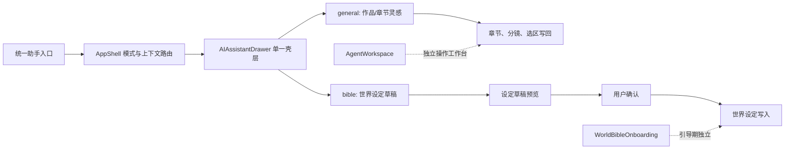

# 发布阻塞项二次修复实施计划

## 2026-08-19：全维度审查问题修复

### 目标

关闭正文污染与审稿门禁缺失、开书设定持久化、交互承诺、LLM 安全边界、书库请求放大、无效向量索引和真实链路测试缺口。

### 执行栈

1. **Stack A：正文输出契约（Coordinator）**
   - 禁止 fallback 把分镜/上下文标签拼入正文；模型失败必须返回诚实错误或明确低保真候选。
   - 对正文候选执行元数据、问答/说明、推理标签、乱码、重复段和最低叙事质量检查；不合格候选禁止接受。
   - 正文主链内置 Critic 判定，不再要求作者先接受或另点审稿才发现硬错误。
2. **Stack B：前端创作旅程**
   - 原子开书、设定精炼持久化与可见失败、真实 CTA、题材/平台标签、驾驶舱诚实统计、欢迎页错误与弹窗可访问性。
3. **Stack C：后端安全与输入边界**
   - 流式思维链过滤、LLM 路由 strict schema、角色关系上下文预算、后台 job 安全错误 envelope。
4. **Stack D：性能、RAG 与验证**
   - 批量书库元数据、向量索引真实消费或显式关闭、`test:all` 自包含、真实后端 E2E 烟测。

### 边界与验收

- 不新增依赖、不修改数据库 schema、不触碰生产 `data.db`，保留现有未提交修改。
- 任何正文污染测试必须先复现“作品/摘要/内部标签/重复模板”再修复。
- 最终执行 typecheck、lint、Node/前端测试、build、隔离数据库 Playwright 与 `git diff --check`。

状态：`IN PROGRESS`

### 2026-08-20：正文文学验收缺口收口

1. **正文级门禁**：保留现有通用污染检查，新增完整章节候选门禁；纯“世界/角色/伏笔证据”标签串、过短文本和缺少基本段落/句子结构时禁止接受。
2. **调用边界**：仅正文扩写、自动生产及最终接受使用章节门禁；选区改写和局部精修继续使用通用门禁，避免误伤短片段。
3. **链路证据**：把浏览器 E2E 的 54 字标签 fixture 改为完整场景样章，断言设定、人物、伏笔以自然叙事出现，并保留审稿失败→精修→接受闭环。
4. **诚实口径**：确定性门禁只证明格式与最低叙事形态；语义质量未审稿时继续显示 `unknown`，不得伪装通过。

验收：正文质量单测、生成/应用回归、全链路 Chromium、typecheck、lint、build 与 `git diff --check`；不新增依赖、不修改数据库 schema、不接触生产 `data.db`。

状态：`PHASE 1 COMPLETE / DETERMINISTIC GATE VERIFIED`（2026-08-23；完整章节候选继续要求至少 4,000 个有效字符，并增加机械审查分数不低于 85 的硬门禁；低分结果返回可定位证据并阻止接受。正文生成、生产报告、编辑器候选接受及审稿精修相关定向前端 30/30、后端 56/56 通过；浏览器整章链路 1/1 通过；`npm run typecheck`、目标 ESLint 与 `git diff --check` 通过。该门禁只证明格式/污染/机械风险受控，人物、世界规则、章节目标和伏笔有效性仍需结构化审稿或人工评审，不能宣称真实 Provider 输出已达到文学出版标准。）

## 2026-08-17：AI 创作全链路一致性与稳定性修复

### 目标

统一正文扩写、选中改写和审稿精修的候选确认语义，修复切章隔离、能力配置并发、拆书试跑归属、设置与 Embedding 诚实降级，以及 E2E 假覆盖和隔离问题。

### 执行栈

1. **Stack A：正文候选与编辑器生命周期**
   - AI 正文变更只生成内存候选，作者接受且基线校验通过后才写入。
   - 重试保留原始输入；切章、切作品和数据库代次变化时取消旧请求并清理状态。
2. **Stack B：设置、Embedding 与配置提交并发**
   - 设置读取失败进入 unknown，不伪装连接成功；Embedding 支持脱敏状态与显式本地重试。
   - 能力配置客户端防重复点击，服务端原子 claim 预览令牌。
3. **Stack C：能力会话、拆书试跑与交互回归**
   - dirty 状态按基线差异计算，拆书试跑绑定卡片和请求代次。
   - 修复短输入、全部阶段说明、流程弹窗可访问性及 E2E 实际结果断言。

### 边界与验收

- 不新增依赖、不修改数据库 schema、不读写生产 `data.db`，保留所有现有未提交修改。
- 行为修改遵循 RED → GREEN；测试使用隔离数据库与确定性 provider fixture。
- 最终执行 typecheck、lint、Node/前端测试、build、Playwright 连续三次及 `git diff --check`。

状态：`CODE COMPLETE / TARGET E2E PASSED`（Stack A/B/C 已完成；候选接受双击互斥、过期候选清理和 Embedding unknown 琥珀态已补齐。正文质量、审稿证据、候选接受与生产流定向回归通过；类型检查、Lint、构建、目标 Chromium 全链路均通过。全量 Node 回归在并发运行时仍有 2 个资源竞争/超时用例，前端全量套件曾长时间无输出并已中止；正文相关前端 4 个文件 28/28 通过。完整回归需在单独、低并发环境复跑，不能据此宣称全套门禁通过。）

### 2026-08-18 复核补丁

- Embedding 状态元数据复用真实 provider 请求的模型选择逻辑，避免向量缓存因错误 `modelId` 被误判不兼容；本地 WASM 显式重试增加并发互斥。
- 设置配置未完成加载时禁止保存，避免错误状态下用默认表单覆盖已有配置；失败状态仍保留用户输入并可重新加载。
- 编辑器和智能管家均提供候选正文双栏预览，并统一“接受并写入 / 放弃预览”入口。

## 2026-08-16：能力全链路复查修复

### 目标

在不新增依赖、不修改数据库表结构、不覆盖现有未提交改动的前提下，关闭本轮复查确认的数据库代次、能力卡应用、伏笔规划/复核、顶部布局和全链路验证缺口。

### 执行栈

1. **Stack A：编辑器一致性读取**
   - `useEditorData` 的核心、章节和辅助数据读取必须通过读取前后 generation 校验形成一致快照。
   - 代次变化时不得提交混合状态，等待数据库变更事件重新加载。
2. **Stack B：收藏与作品默认拆分**
   - 新增可选 `projectTechniqueIds`；新配置显式区分收藏与全文默认。
   - 旧 profile 缺少新字段时兼容现有 `favoriteTechniqueIds` 默认行为；首次新写后完成分离。
3. **Stack C：伏笔进入规划与复核**
   - 主纲/卷纲/章纲生成和章节 planner 消费开放伏笔及计划动作。
   - 世界观/角色候选接受后为关联叙事承诺创建复核要求；结构化候选提前拒绝不存在的伏笔引用。
4. **Stack D：设定页闭环与代次安全**
   - 世界观/角色能力卡先原子保存配置，再携带能力意图进入设定页并生成可审阅候选。
   - 设定页读取和所有增删改绑定同一 generation；失败保留本地输入并提示刷新。
5. **Stack E：布局与端到端证据**
   - 修复 1280x720、智能管家展开时的编辑器头部重叠。
   - E2E 验证能力 ID 进入执行快照、世界观/角色/伏笔影响链和最终正文证据，不再只断言按钮或字数。

### 验收与停止条件

- 每个行为变更必须先有失败测试并观察到预期 RED，再做最小实现并观察 GREEN。
- 定向 Node/Vitest/Playwright 测试使用隔离数据库；禁止接触运行中的 `data.db`。
- 最终门禁：`npm run typecheck`、`npm run lint`、`npm test`、`npm run test:frontend`、目标 Chromium E2E、`npm run build`、`git diff --check`。
- 若新旧 `favoriteTechniqueIds` 无法无损区分，保留“字段缺失时按旧默认、字段存在时按新语义”的兼容策略，不做数据库迁移。
- 若世界观/角色候选缺少明确目标，不自动写 Canon；停在可选择目标或候选确认界面。

状态：`DONE`（2026-08-17；Node 1028/1028、前端 784/784、目标 Chromium 6/6 通过）

## Plan 149：写法确认、阶段技能与创作导航治理

### 目标与边界

- 将项目基调、Writer Skill、资料包文风与会话写法卡解析为服务端唯一写法快照，并以 SHA-256 指纹确认。
- Writer 正文生成、改写、润色与章节生产必须在配额、run/job 和模型调用前校验 `styleConfirmationFingerprint`；手写、保存、切章与纯 Critic 审稿不受阻。
- `mountedSkillLoadout` v2 固定 slot 0/1/2 为 Planner/Writer/Critic；歧义旧数据进入待放置，不跨槽补位。
- 编辑区和自动生产区显示紧凑“本次写法”条；首次或来源变化时确认后仅恢复原动作一次。
- 创作导航固定为分镜、生成正文、审稿、查设定，并将大纲、写法技能、节奏、伏笔、创意与版本按阶段归组。

### 验收

- 覆盖首次/陈旧确认 409 零副作用、跨作品资料包、临时卡授权与数量、阶段隔离、槽位迁移、来源指纹稳定性、确认恢复和窄屏键盘交互。
- `npm run typecheck`、`npm run lint`、`npm test`、`npm run test:frontend`、`npm run build`、`npx playwright test --project=chromium` 全部通过后标记 `DONE`。

状态：`DONE`

## Plan 148：Beta 权益与付费边界诚实化

### 目标

在没有订单、订阅、到期与服务端会员身份的当前 Beta 中，默认关闭商业付费门禁，保证本地写作与用户自带 API Key 的核心 AI 主链可继续使用；保留显式实验开关，为后续真实商业化接入复用现有额度测试。

### 实施边界

1. 后端额度治理
   - 新增显式 `INKFLOW_ENABLE_MONETIZATION=true` 开关；非测试运行默认关闭，现有测试环境默认保持开启。
   - 门禁关闭时仍校验作品存在和数据库 generation，但不消耗、不拦截 5/10/5 额度。
   - 由服务端调用点区分基础 BYOK 与增强工作流；基础 BYOK 不计平台实验额度，客户端不得自行声明访问类型。
   - `commercialMode='strict'` 仅作为写作治理模式，不再等同 `paid` 权益。
   - 通用 `/api/db` 作为客户端信任边界：不得创建 `paid` 作品或改写 `quotaLimits`；已有受信权益只能由服务端内部流程变更。
   - 保留预留、提交和退款语义及其既有测试。
2. 前端权益治理
   - 新增统一增强能力判断；商业化关闭时 Beta 默认开放增强包和授权技能。
   - 商业化实验开启时，只允许服务端作品状态 `paid` 放行增强能力；删除本地访问码/会员状态，`strict` 也不得绕过。
   - 挂载统一能力提示，接收现有 `local-capability-unavailable` 事件；不得模拟交易或直接把作品改为 paid。
   - 设置页将 Premium 购买叙事改为“内测增强能力”，删除“永久会员、全部 AI、100% 畅通”等承诺。
3. 产品文档
   - 明确当前无真实付费、Beta 默认开放、未来 Free/Pro/托管模型额度的边界。
   - BYOK 基础生成不得以模型成本为理由收费；托管模型调用未来作为独立额度产品。
   - 明确本地 SQLite 与整库备份中的实验状态不是抗篡改购买凭证；正式商业化必须以独立可核验权益账本为前置条件。

### 验收

1. RED/GREEN 覆盖：默认 Beta 不拦截已耗尽作品；基础 BYOK 在商业化开启时仍不计平台额度；增强工作流继续执行额度；`strict` 和本地访问码均不绕过；前端 Beta 增强能力放行。
2. 设置与能力提示不得出现模拟交易、VIP 专线、永久会员、无限模型调用等未实现承诺。
3. 运行聚焦后端/前端测试、`npm run typecheck`、目标 ESLint、`npm run build`、相关 Playwright 与 `git diff --check`。
4. 不新增依赖、数据库迁移、支付占位接口或客户端伪造的会员身份；HTTP 回归必须覆盖 `createNovel` 和 `updateNovel` 的权益篡改。

## 目标

在不新增依赖或数据库迁移的前提下，关闭 Audit / Rewrite 时序与持久化问题、Electron 与下载安全缺口、配额退款幂等缺口、数据库导入关闭竞态，并修复计划索引。

## 第一波并行边界

- Agent A（T1）：Audit / Rewrite 后端与前端生成流、对应测试。避免修改配额 helper 的公共契约。
- Agent B（T2）：Electron 来源/协议/IPC 校验、下载 helper 与对应测试。
- Agent C（T4、T5）：数据库实例/导入串行化、数据库竞态测试、计划索引。避免修改 Audit 路由。

## 第二波协调

- Coordinator（T3）：在第一波完成后统一修改 quota guard 及所有 reserve/refund 调用方，处理与 Audit 路由的契约交集。

## 验收门禁

1. `npm run typecheck`
2. `npm run lint`
3. `npm test`
4. `npm run test:frontend`
5. `npx playwright test`

Plan 110 仅在上述门禁和独立 Gatekeeper 复核全部通过后保留为 DONE。

## Plan 121：全仓流式断连治理

- Coordinator：扩展 `stream-disconnect`，提供幂等绑定与 dispose。
- Agent A：迁移 `world.ts`、`simple-llm.ts` 普通 SSE。
- Agent B：统一迁移 `agents.ts` 三处 SSE，保留交付前退款、交付后提交语义。
- Agent C：迁移数据库事件流，补测试和计划台账。
- Gatekeeper：全仓搜索、门禁和断连/配额语义独立复核。

Plan 121 的全部命令与独立 Gatekeeper 复核已通过，状态收口为 `DONE`。

## Plan 122–125：写作数据安全闭环

### 目标

在不新增依赖、不修改数据库业务 schema 的前提下，消除退出丢稿、幽灵章节、人物小传流式部分落盘和错误备份替换主库的风险。

### 并行边界与顺序

- Agent A（Plan 122 → 123）：串行重构编辑器五类字段保存队列、显式 flush、Electron 关闭握手，再收紧章节创建和 update/delete 成功语义。
- Agent B（Plan 124）：人物小传使用严格 SSE reader、节流本地预览、完成后单次落盘及失败恢复。
- Agent C（Plan 125）：唯一临时文件预检、SQLite 完整性/外键/schema/关键查询验证，再进入现有串行替换流程。
- Coordinator：总装跨层契约、计划台账和项目切换边界。
- Gatekeeper：使用隔离数据库独立复核定向持久化测试、全量门禁和打包契约。

### 完成条件

`npm run typecheck`、`npm run lint`、`npm test`、`npm run test:frontend`、`npx playwright test`、`git diff --check` 全部通过后，Plan 122–125 才能从 `IN PROGRESS` 收口为 `DONE`。

GitHub 官方 Playwright、runtime smoke、macOS 与 Windows 打包及全部本地门禁均已通过，Plan 122–125 状态收口为 `DONE`。

## Plan 126：发布数据安全复核收口

- 将编辑器章节选择改为 ID 与完整实体分离，完整正文返回前保持加载态，使用请求序号阻止迟到响应覆盖。
- 所有 AI 正文/分镜写回和全局助手应用动作先等待编辑器写队列，失败时不启动或提交 AI 覆盖。
- 数据库导入增加 `integrity_check`、应用标识、初始化后复检、同盘 rename 和时间戳备份。
- 致命后端异常进入拒绝新请求、drain、关闭、非零退出流程。
- 收紧前端同源鉴权、数据库事件重连和 `/api/db` 方法参数 registry。
- 打包 CI 启动真实 Electron，执行输入、立即退出、重启和正文校验。

Plan 126 仅在本地全量门禁及 macOS/Windows packaged lifecycle smoke 全部通过后标记 `DONE`。

## Plan 129–131：发布阻塞收口

### 目标

在不新增依赖或业务 schema 迁移的前提下，关闭跨作品数据污染、异步 AI 跨库写回、LLM 取消与成本治理、Electron 退出恢复以及压缩包资源耗尽风险。

### 并行审查边界

- Agent A（Plan 129）：归属与事务、database generation、导入 schema 白名单、DB 核心字段不可变。
- Agent B（Plan 130）：provider 真取消、execution gate、配额/并发/速率、后台任务取消。
- Agent C（Plan 131）：Electron 关闭恢复、Watchdog 固定端口、ZIP/DOCX 资源预算。
- Coordinator：补丁导入、跨层契约总装、测试 ABI 顺序、计划台账与最终提交。

### 验收门禁

1. `npm run typecheck`
2. `npm run lint`
3. `npm test`
4. `npm run test:frontend`
5. `npx playwright test`
6. `npm run build`
7. `git diff --check`
8. macOS/Windows 打包及 packaged lifecycle smoke

Plan 129–131 在完整 Node 原生测试、Playwright 和双平台打包生命周期全部通过前保持 `IN PROGRESS`。

## Plan 134：续写资料冲突裁决闭环

### 目标

在不新增依赖或数据库迁移的前提下，让 AI 给出的冲突方案可被用户采纳、服务端验证并随资料包持久化，解除确认按钮死锁，并将已采纳裁决注入后续写作上下文。

### 并行边界

- Agent A（前端）：确认页展示冲突证据与可编辑方案，逐项采纳后启用确认；审批请求携带裁决。
- Agent B（后端/共享）：扩展冲突 JSON 类型与审批校验，原子持久化裁决，并写入续写上下文。
- Gatekeeper：覆盖未解决 high 冲突阻断、采纳后放行、伪造 ID 拒绝、上下文注入及前端交互。

### 验收

`npm run typecheck`、`npm run lint`、相关后端/前端测试、`git diff --check` 全部通过；不得绕过未解决的 high 冲突，不修改数据库表结构。

## 资料包解析误报额度不足

1. 资料包实体解析不再占用“智能审稿”本地额度；保留并发与请求限流。
2. 将执行守卫的限流/数据库变化按真实原因映射，避免统一误报为额度不足。
3. 增加“本地审稿额度已耗尽仍可解析资料包”的回归测试。

验收：相关集成测试、TypeScript 类型检查通过；当前作品可重新发起解析。

## 密集资料批次持续 Schema 失败

1. 单类实体不再被 50 条固定上限误拒，改为与已有总密度守卫共用 180 条上限。
2. `tier` 的越界数值安全归一到 0–100，保留 warning。
3. 回归覆盖现场的 52 个道具与 `tier=-1` 同批输出，并验证超过 180 条仍被拒绝。

## 提取失败后视图跳动

1. 提取错误改为就地显示在当前资料包卡片，不再插入顶部上传区；同步错误在同步预览期间继续保持可见。
2. 上传、审批等无错误码失败仍保留在上传区。
3. 回归验证失败后仍保留当前资料包与资料包管理视图。

## 待确认关系阻塞同步

1. 有待确认关系时，主按钮改为明确的“跳过 N 条并确认同步”，不再直接禁用。
2. 提交时强制过滤所有未确认关系，避免无效引用写入设定。
3. 回归验证按钮可点击、未确认关系不进入同步请求。

## 部分同步与关系修复闭环

1. 同步接口接受多批合并后的大纲、规则与人物特征，不再沿用单批上限误拒。
2. 有待确认关系时先同步可确认内容，成功后保留预览并自动进入关系页。
3. 待确认关系修复完成后再次确认，关闭预览并完成同步。
## 部分同步后预览收敛

1. 已导入或已提交的各类条目从预览和后续同步请求中排除。
2. 进入逐条处理后，仅展示本轮待确认关系，并为每条关系提供匹配或明确跳过操作。
3. 实体列表刷新后自动识别已修复关系，最终只提交修复完成的关系。

## 编辑器右栏与导入后引导

1. 打开智能管家时收起写作区内置遥测栏，避免同屏双右栏挤压正文。
2. 智能管家使用可见的分组网格导航和独立纵向滚动区，适配短视口。
3. 关闭章节引导后保留恢复入口，并明确资料导入后的分镜、扩写、审计、润色顺序。

## 已完成实体提取 Job 接回同步预览

1. `ContinuationPackView` 从本地 URL 读取 `extractionJobId`、`extractionPackId` 与 `databaseGeneration`，仅对当前作品内匹配的资料包调用现有只读重查接口。
2. 已完成 Job 直接恢复为现有 `SyncPreviewPanel`；不得调用 resume、创建新 Job 或自动执行 `sync-to-world`。
3. 恢复参数在用户取消预览、切换资料包或成功同步后清除，避免刷新后重复恢复已处理结果。
4. 回归测试验证 completed Job 打开预览、只调用 requery 一次且不调用 extract/resume。

验收：前端定向测试、typecheck、lint 与 `git diff --check` 全部通过；真实 Job 只打开预览并停在最终确认前。

## 待确认关系的资料驱动 Agent 推荐

1. 为待确认关系提供显式的批量 Agent 推荐入口；推荐只读，不得自动同步或修改数据库。
2. 后端按 `packId` 重新读取资料包原文，为每条关系截取可核验的证据片段；Agent 只能从当前同类型候选实体中推荐映射，证据不足时必须建议跳过。
3. 推荐结果包含映射动作、候选实体、置信度、理由和来源文件证据；模型返回的候选名与证据标识必须由服务端再次校验，禁止虚构资料外事实。
4. 前端区分“推荐映射 / 存在歧义 / 建议跳过”，保留手工下拉与跳过能力；只有用户点击采用后才写入本地预览选择。
5. 批量请求必须校验作品归属、数据库 generation、关系数量和候选上限；失败时保留原手工流程并显示可重试错误。
6. 原文证据最多保留 4 条，并在双方实体都有命中时优先覆盖双方，避免高频源实体挤掉目标实体证据而造成误判。

验收：资料证据选择与响应归一化单测、关系推荐 UI 定向测试、相关后端测试、typecheck、lint、`git diff --check` 通过；真实资料调用可将“半夏”高置信度映射为“叶半夏”，并返回“叶半夏 × 许墨”冲突线原文；推荐不会自动执行 `sync-to-world`。

## 实体提取 Job 活跃生命周期

1. 30 分钟 TTL 改按最后有效活动时间清理，不再按首次创建时间误删仍在推进或刚失败待续跑的长任务。
2. 创建、运行、批次推进、完成、失败、取消、代次失败与 resume 刷新活动时间；普通 GET 轮询不得续命。
3. 活动时间属于服务端内部状态，不进入 Job 安全响应；任务仍保持现有内存模型，服务重启后不恢复，不新增数据库迁移。
4. 时间注入集成测试覆盖任务总年龄超过 TTL、近期失败活动仍可 resume 并完成；测试使用独立临时 SQLite 与模型 mock。

验收：后端集成测试 49/49、关系与同步组合测试 56/56、前端恢复与推荐测试 7/7、typecheck、ESLint、`git diff --check` 全部通过。

## 已确认资料包风险处理闭环

### 目标

在不新增依赖、数据库字段或额外模型调用的前提下，让总览中的待处理冲突可进入资料包详情，并允许用户采用或编辑导入时由 Agent 基于原资料生成的冲突建议。

### 并行边界

- Luna Backend：新增已确认资料包冲突裁决接口，校验作品归属、数据库 generation、冲突 ID 与裁决内容，复用现有原子更新逻辑；负责后端定向测试。
- Luna Frontend：风险卡补查看入口与准确文案；资料包管理展示证据、Agent 初始建议和逐项保存动作；负责前端定向测试。
- Sol：调整总览只统计未解决冲突，审查并发改动和脏工作区边界。
- Gatekeeper：独立执行定向测试、typecheck、lint 与 `git diff --check`。

### 验收

1. `ready` 资料包存在中低风险冲突时，总览显示“待处理冲突”并可定位当前资料包。
2. 已确认资料包可采用或编辑已有 Agent 建议，服务端安全持久化；失败时保留原状态并给出错误。
3. 已解决冲突不再触发风险状态或计入待处理数；审读问题明确为创作决策，不伪装成阻塞故障。
4. 不调用真实模型，不新增依赖或迁移，不覆盖工作区现有改动。

## 图谱空态资料包同步入口

### 目标

当编辑器图谱没有世界设定实体、但当前作品存在已确认资料包时，将空态主动作从“手动添加人物”切换为“从资料包同步”，跨视图自动启动现有实体提取，并停在同步预览等待用户确认。

### 边界

- Luna UI：调整 `RelationshipGraph` 空态层级和 `AgentWorkspace` 的已确认资料包选择、启动意图与导航。
- Luna Workflow：在 `ContinuationPackView` 消费一次性启动意图，复用 `handleSyncEntities`；防止重复触发、错作品和未批准资料包。
- Sol：审查跨视图闭环、现有脏工作区边界与最终交互。
- Gatekeeper：验证类型、Lint、空态分支、跨视图自动提取及停留预览契约。

### 验收

1. 实体数为 0 且存在已确认资料包时，显示“从资料包同步”为主按钮，“手动添加人物”为次按钮。
2. 点击后进入资料包管理，定位目标资料包并只自动启动一次现有提取流程。
3. 提取完成后必须停在 `SyncPreviewPanel`，不得自动调用 `sync-to-world`。
4. 没有已确认资料包时保持原“去添加人物”空态；不新增接口、依赖或数据库迁移。

## 关系推荐模型计费错误闭环

1. 将模型服务 HTTP 402 单独归类为额度/计费不可用，不再误报为参数不兼容。
2. 关系推荐接口仅返回脱敏、可操作的错误码与文案；不得暴露 API Key 或供应商原始响应。
3. 前端错误态保留手工关系处理与重试，并提供“打开设置”入口；不得把模型失败伪装成推荐成功或自动跳过关系。
4. Luna 分别负责后端分类与前端交互，Sol 审查总装，Gatekeeper 运行定向测试、typecheck、lint 与 `git diff --check`。

验收：402 分类、关系接口错误契约、前端设置入口均有回归测试；不新增依赖、数据库迁移或真实模型测试调用。

## 智能管家导航收敛

### 目标

将智能管家 13 个同级入口收敛为当前写作主流程，降低窄视口导航占用，同时保留现有业务能力与跨视图动作。

### 方案

1. 一级导航仅展示“当前、分镜、自动生产、审计、查设定、更多”，采用三列两行稳定布局。
2. “当前”统一承接 `context` 与 `copilot-home` 的导航状态；“查设定”统一承接 `bible` 与 `trace`，并在设定检索中保留“扫描本章实体”入口。
3. “大纲、技能装备、伏笔、创意、版本”收入可键盘访问的“更多”菜单；菜单显示当前低频模块状态并在选择后关闭。
4. “节奏”不再显示导航入口，但保留组件、类型和已有调用代码，不删除数据能力。
5. 不修改生产、审计、设定、版本等业务逻辑，不新增依赖、接口或数据库迁移。

### 验收

1. 522px 视口下一级导航仅两行，不发生文字截断或控件溢出。
2. 主流程和“更多”内所有保留功能仍可到达；`copilot-home`、`trace` 被正确归入对应一级状态。
3. “扫描本章实体”可从“查设定”进入原追踪面板。
4. 聚焦前端测试、TypeScript、ESLint 与 `git diff --check` 全部通过。

## 资料包确认与设定同步状态澄清

### 目标

修复资料包卡片“已确认”被误认为“已完成同步”的问题，并让已确认资料包无需先展开详情即可进入现有同步预览流程。

### 边界

- Luna UI：仅修改 `ContinuationPackView` 与聚焦前端测试；复用现有提取、预览和确认写入能力。
- Sol：审查文案、入口、同步成功反馈及脏工作区边界。
- Gatekeeper：执行定向 Vitest、TypeScript、目标 ESLint 和 `git diff --check`。
- 不新增依赖、接口、数据库字段或迁移；不自动调用 `sync-to-world`，最终写入仍由用户在预览中确认。

### 验收

1. approved 状态明确显示为“资料包已确认”，并提示尚需提取、预览和确认写入。
2. 已确认资料包列表卡片直接提供“提取并预览”动作，点击只启动提取并打开预览。
3. 同步成功后展示本次新增人物、地点、物品、势力、战力、时间线和关系的汇总。
4. 现有自动提取仍不得直接调用 `sync-to-world`。

## 世界设定助手右侧抽屉

### 目标

将世界设定对话助手从默认占宽的第三栏改为默认收起、按需打开的右侧覆盖抽屉；在资料包、人物、地点、道具、势力、时间线和关系等设定板块之间切换时保持同一会话。

### 边界

- Luna UI：仅修改 `WorldBibleView` 与一个聚焦前端测试，复用现有消息、提交和实体确认逻辑。
- Sol：审查抽屉层级、窄视口、键盘关闭、状态持续和脏工作区边界。
- Gatekeeper：执行定向 Vitest、TypeScript、目标 ESLint 和 `git diff --check`。
- 不新增依赖、接口或数据库迁移；不接入编辑器 `AgentWorkspace`，不改变模型提示词和写入行为。

### 验收

1. 助手默认收起，主内容区不再因固定 `w-96 shrink-0` 面板而变窄。
2. 右侧入口可打开覆盖式抽屉，抽屉支持关闭按钮和 Escape，按钮具备准确的可访问状态。
3. 切换任意世界设定子板块后抽屉和会话保持，不创建第二份助手。
4. 1087×814 与窄内容栏下无溢出或主内容重排；不调用真实模型或写入数据库。

## 二阶段：作品级常驻助手

### 目标

把第一阶段的世界设定局部抽屉升级为作品级常驻能力：用户切换驾驶舱、编辑器和设定集后，仍从同一个全局入口打开助手，并按作品与模式保留会话；不合并编辑器 `AgentWorkspace` 的操作型工作流，也不改变任何现有模型协议和写库确认规则。

### ADR：单一壳层、领域分流

采用 `AppShell -> AIAssistantDrawer -> general | bible` 的单一全局抽屉壳层。

- `general` 继续使用现有 `AIAssistant`，负责灵感、章节和选区协作。
- `bible` 使用从 `WorldBibleView` 提取出的设定助手领域组件，保留 SSE、`[JSON_DATA]` 草稿解析和用户确认后写入。
- `AgentWorkspace` 继续负责编辑器内生产、审计、分镜、查设定等确定性动作，不并入聊天会话。
- `WorldBibleOnboarding` 继续使用独立“设定引导助手”，完成引导后才进入作品级助手。
- 不把两套 `/api/inspiration` 请求协议合并；不让 `bible` 复用 `AIAssistant` 当前会直接调用 `importWorldExtraction` 的“提取到设定集”动作。

不采用两个并存的全局抽屉，因为会重复焦点管理、遮罩和会话入口；不采用把三套助手合成一个聊天组件，因为它们的输出协议、写回权限和生命周期不同。

### 状态与安全边界

1. `app-store` 只持有抽屉 UI 状态：`isOpen`、显式 `mode: 'general' | 'bible'` 和只含 ID、枚举、文本的可序列化 surface context；禁止仅根据 `currentView` 猜模式。
2. 作品级会话按 `novelId + mode` 隔离，保存消息、输入和领域草稿；切换模式只隐藏当前 session，不清空输入或草稿。无作品的灵感会话使用独立 welcome key。二阶段仅内存保存，不写 `localStorage`，不新增数据库表。
3. `AbortController`、流 reader、DOM 引用和订阅句柄保留在组件 ref，不进入 Zustand。
4. 每次请求绑定 `novelId + mode + sessionId + requestId`；关闭抽屉、切模式、切作品时取消请求并使旧响应失效。
5. 所有章节或设定写入前再次校验当前 `selectedNovel.id`、目标章节/实体归属与数据库 generation；校验失败只提示，不写入。
6. `bible` 只能先生成草稿，必须由用户确认后调用现有 `createX`；禁止自动导入或静默写库。
7. 任一时刻最多一个助手 surface 可交互。全局抽屉打开时，编辑器 `AgentWorkspace` 可保留内部状态但必须隐藏或失去交互；关闭全局抽屉后可恢复。

### 上下文路由

| 当前视图 | 默认模式 | 显示名称 | 上下文 |
|---|---|---|---|
| Welcome / 无作品 | `general` | 灵感助手 | 无作品，只允许方案与灵感 |
| Workspace / 驾驶舱 | `general` | 作品助手 | `novelId`、作品标题 |
| Editor | `general` | 作品助手 · 当前章节 | `novelId`、`chapterId`、选区与用户意图 |
| World Bible 普通页 | `bible` | 设定助手 | `novelId`、当前设定 tab、可选实体 ID |
| World Bible onboarding | 独立引导模式 | 设定引导助手 | 当前 setup task，不进入全局会话 |

抽屉头部必须显示当前模式，并提供显式的“作品助手 / 设定助手”切换；World Bible 入口直接打开 `bible`，Editor、Workspace 和 Sidebar 入口按上表路由到 `general`，禁止沿用上一视图的隐式模式。

### 实施批次

#### 批次 1：契约测试与状态路由

- Luna Test：先补 AppShell 集成测试，锁定模式路由、模式切换、作品隔离、onboarding 优先级和单 surface 互斥。
- Luna State：扩展助手打开契约和 surface context 类型；加入按作品隔离的会话状态，但不迁移现有业务组件。
- Sol：审查状态只保存可序列化领域数据，并确认旧入口行为不变。

完成条件：测试先失败且准确描述新契约；类型定义不包含请求对象或 DOM 引用。

#### 批次 2：提取设定助手领域组件

- Luna Bible：从 `WorldBibleView` 提取消息 UI、SSE 生成、JSON 草稿和确认写入为独立组件；从 `novelId` 获取所需世界设定上下文。
- Luna Shell：让 `AIAssistantDrawer` 根据显式 mode 渲染 `general` 或 `bible`，复用现有 Escape、焦点陷阱、遮罩和焦点恢复。
- 禁止两个 Luna 同时修改 `AIAssistantDrawer.tsx` 或 `WorldBibleView.tsx`；交叉接线由 Sol 总装。

完成条件：旧 World Bible 助手代码在迁移期可以暂存但不得同时渲染第二个抽屉；原 SSE 增量显示、JSON 失败降级、清空、关闭和确认写入行为不变。

#### 批次 3：跨视图入口与互斥

- World Bible 的 Sparkles 按钮通过统一打开契约进入 `bible` 并携带当前 tab。
- Editor 和 WritingSurface 的现有入口进入 `general` 并携带章节/选区上下文。
- Sidebar / 驾驶舱入口在有作品时打开作品级助手；无作品时保持灵感助手。
- 全局抽屉与 `AgentWorkspace`、onboarding 助手建立可见性互斥，不清空对方草稿。

完成条件：跨视图切换不丢当前作品会话，不出现双遮罩、双 Escape 监听或两个可交互右栏。

#### 批次 4：并发安全与收口

- 为 `general` 和 `bible` 请求增加取消与 request epoch；切作品、切模式、卸载时终止旧请求。
- AppShell 的正文、分镜、选区写回增加当前作品与目标章节复核。
- 确认设定草稿时复核作品与数据库 generation；旧作品草稿只保留在旧 session，不可在新作品提交。
- 删除已迁移的 World Bible 本地 drawer state 和重复 UI，不删除 `AgentWorkspace` 或 onboarding 能力。

完成条件：延迟响应不能进入新作品会话，旧上下文按钮不能跨作品写入。

### 预计文件边界

- `shared/types/core.ts`：显式 assistant mode / surface context 契约。
- `src/stores/app-store.ts`：全局抽屉模式与打开动作。
- `src/stores/assistant-session-store.ts`：按作品和模式隔离的可序列化会话；`novel-store` 继续只持有当前作品和启动上下文。
- `src/components/AIAssistantDrawer.tsx`：唯一抽屉壳层和模式切换。
- `src/components/AIAssistant.tsx`：general 请求失效与写回能力约束。
- `src/components/world-bible/WorldBibleAssistant.tsx`：设定助手领域组件。
- `src/components/WorldBibleView.tsx`、`src/components/AppShell.tsx`、`src/components/EditorView.tsx`：入口、上下文和互斥接线。
- 聚焦测试文件：AppShell 助手路由、设定助手会话、编辑器互斥与陈旧响应。

### 测试矩阵

1. World Bible 打开即为 `bible`；Editor 打开即为 `general`；模式标题和能力按钮匹配。
2. 关闭重开、跨 World Bible 子 tab、跨 workspace/editor/world 后，同一作品会话保留。
3. A/B 两部作品的消息、输入和设定草稿完全隔离；请求中切作品后旧响应被丢弃。
4. `bible` 生成只产生草稿；未确认不调用任何 create/import；确认一次只写一次。
5. `general` 的章节、分镜、选区写回只作用于当前作品和当前章节。
6. onboarding 打开时不渲染作品级 `bible`，一次性自动打开语义保持。
7. 全局抽屉与 `AgentWorkspace` 不同时可交互；关闭后原 Agent tab 和草稿仍在。
8. Escape、遮罩点击、Tab focus trap、模式切换后的焦点位置、关闭后焦点恢复和 `aria-expanded` 全部通过；抽屉打开时背景和 Sidebar 不可交互。
9. 迟到 SSE token、迟到失败响应和关闭后的回调不污染当前 session；重复点击确认只写入一次。
10. 1087×814、797×674、522×674 三个视口无横向溢出、正文重排或文字遮挡。

### 验证门禁

1. 相关 Vitest 契约与组件测试。
2. `npm run typecheck`。
3. 目标文件 ESLint；总装后执行 `npm run lint`。
4. `npx playwright test` 使用隔离数据库和模型 mock，禁止访问运行中的 `data.db`。
5. `git diff --check`，并由独立 Gatekeeper 复核实际差异、退出码和写入权限边界。

### 回滚与非目标

- 每批保持可独立回退；批次 2 验收前保留旧 World Bible 助手实现，统一抽屉通过后再删除重复壳层，不引入长期 feature flag。
- 不新增依赖、接口、数据库迁移或本地会话持久化。
- 不统一两套 prompt/响应协议，不重写 `AgentWorkspace`，不自动执行设定写入，不调用真实模型。

## 续写入口自动生产闭环（2026-08-07）

### 根因

- `world-overview` 会打开编辑器的自动生产面板，但 `prefillIntent` 被写入分镜的 `userIntent`，生产输入仍为空。
- 路由只完成静态面板切换，没有执行“开始续写”所承诺的生产预览动作。

### 最小实现

1. 生产流启动方法支持一次性的意图覆盖，并用同一个解析后意图创建预览状态与请求载荷。
2. `world-overview` 与 `continuation-import` 启动源等待目标章节和 approved pack 选中后，自动启动一次生产预览。
3. 每个 `launchToken` 只消费一次；不自动接受预览，不直接写入章节正文。
4. 补充组件/Hook 定向测试，覆盖意图透传、自动启动和非续写来源不误触发。

### 验证与回滚

- 运行定向 Vitest、`npm run typecheck`、`npm run lint` 与 `git diff --check`。
- 浏览器使用现有 approved pack 验证：进入编辑器后生产输入非空且自动出现运行/失败/预览状态。
- 回滚只需撤销本节对应的生产流参数与 EditorView 启动 effect，不涉及数据库、迁移或依赖。

## 驾驶舱继续写作主入口（2026-08-07）

### 根因

- 驾驶舱顶部行动卡只判断“章节数量大于 0”，文案和按钮固定为精修、审计。
- 空章节也会被描述为“第一章已生成、检测到 2 个悬念”，与 0 字真实状态冲突。
- 真正的自适应推荐已区分分镜、正文、审计、精修阶段，但顶部主入口没有复用这些状态。

### 最小实现

1. 以最新章节的正文、分镜、审稿意见和 metadata 字数计算真实创作阶段。
2. 顶部只保留一个明确主动作：优先按 approved pack 继续写作，否则进入最近章节。
3. 次动作按阶段显示：空正文为规划分镜或生成正文；有正文无审稿为审计；有审稿意见后才显示精修。
4. 删除硬编码悬念数量、机械扫描结论和装饰性背景，保持专业创作控制台的安静层级。
5. 新增隔离组件测试，锁定空正文不显示审计/精修、资料包续写入口可点击、有正文后质量动作按阶段出现。

### 验证与回滚

- 定向 Vitest、TypeScript、目标 ESLint、`git diff --check`。
- 浏览器在 797×674 当前视口验证主动作首屏可见、文字不截断、按钮不重叠。
- 不修改推荐算法、数据库、API 或资料包结构；回滚仅涉及驾驶舱组件和新增测试。

## 续写资料缺口助手闭环（2026-08-07）

### 根因

- 自动生产页只展示资料包解析出的前两条 `continuationGaps`，没有任何处理入口。
- 缺口类型没有已解决状态，现有资料包更新接口也不支持修改缺口；直接隐藏或标记完成会伪造状态。

### 最小实现

1. 每条缺口提供“让设定助手补齐”动作，携带描述、建议方向和相关事实。
2. 复用作品级设定助手会话，打开抽屉并预填请求；不自动提交模型请求。
3. 助手只能先生成可编辑确认单，用户点击确认后才调用现有设定写入接口。
4. 不修改资料包、数据库结构或同步接口，不把生成预览冒充为缺口已解决。

### 验证与回滚

- 聚焦组件测试验证按钮和完整缺口载荷；AppShell 测试验证 `bible` 模式与预填输入。
- 运行 TypeScript、目标 ESLint、`git diff --check`，并在 1087×814 与 522×674 检查无溢出。
- 回滚仅撤销缺口按钮、回调透传和聚焦测试，不涉及数据迁移。

## 生成上下文凭证信息收敛（2026-08-07）

1. 将始终展开的四项上下文凭证改为原生 `details/summary`，默认仅显示“生成上下文已就绪”。
2. 目标章节、资料包、技能和世界观数量保留在按需展开区，不删除诊断信息。
3. 窄右栏下详情使用单列布局，避免截断和视觉拥挤；保留原生键盘可访问性。
4. 新增组件测试覆盖默认折叠、点击展开和完整详情，不新增状态、依赖、接口或数据变更。

## 结构工坊窄栏布局修复（2026-08-07）

1. 流程向导卡改为稳定纵向布局，避免视口断点在 360px 智能管家栏内误触发横排。
2. 内容与操作区补齐最小宽度约束，长步骤名称按钮占满卡片并允许换行。
3. 保留流程推进、质量门栏与导航逻辑；不修改流程数据、接口、依赖或数据库。
4. 聚焦测试锁定窄栏布局契约，并在 1087×814 与 522×674 验证无横向溢出。

## 当前页全局关系回退（2026-08-07）

1. 正文命中关系继续使用现有过滤结果，不伪造本章关联。
2. 正文没有命中、但作品已有全局关系时，当前页复用现有关系图并明确标注为作品全局关系。
3. 标题与计数随关系范围切换，移除“已有数据却只显示空态”的大块空白。
4. 新增 AgentWorkspace 集成测试；不修改关系数据、API、依赖或数据库。

## InkFlow P0-P2 产品收敛（2026-08-07）

### 目标主链路

`导入资料 → 审核/同步设定 → 分镜 → 正文 → 审计 → 精修 → 下一章`

- 作品总览负责阶段决策，编辑器负责执行，右侧工作台只提供工具。
- 资料同步采用软门槛；手动写作始终可用。
- Critic UNKNOWN 经二次确认后可接受；不得伪造 PASS 或评分。
- 产品指标仅保存在本地，不记录正文、提示词、资料原文或模型输出。

### 交付顺序

1. P0：统一 workflow 状态、资料包同步四态、Critic 三态、真实 Context Receipt 和跨视图动作闭环。
2. P1 Schema：附加 `chapter_production_run_versions`、`continuation_extraction_jobs`，来源文档增加可选 `sha256`。
3. P1 并发：生产版本精确接受、提取任务重启恢复、五类结构化审计。
4. P2：本地 `product_events`、设置页指标/导出/清除、高级入口治理。
5. 总装：隔离数据库的 Node/Vitest/Playwright、构建、三视口浏览器验收。

### 边界与回滚

- 保持 React + TypeScript + Vite + Express + SQLite，不新增依赖或分布式队列。
- SQLite 只做附加列/表；旧代码可忽略新字段，不执行破坏性降级。
- 不调用真实模型、不上传指标、不修改 WAL 备份规则。
- 每阶段通过独立规格与质量复审后才能进入下一阶段。

## InkFlow P0-P2 可信度与主流程修复（2026-08-07）

### 锁定契约

- `chapters.workflow_meta` 为附加 JSON 列；章节审计与精修状态必须绑定正文和分镜的 SHA-256，内容变化后自动失效。
- 工作流统一为 `review/sync/planning/drafting/audit/polish/next_chapter`，驾驶舱、编辑器引导、正文区和 Agent 工作台只消费同一个派生函数。
- 审计任务传输状态与审计质量状态分离；不可解析结果为 `unknown`，不得保存成成功审计。
- `unknown/not_run` 生产结果必须前后端双重确认；Context Receipt 只证明实际注入文本。
- 无硬设定资料包警告后可导入；只有未裁决 high contradiction 阻断。
- 产品指标按对象去重并显示样本量；商业入口不伪装可升级，本地激活码与伪权益状态不再读取或参与门禁。

### 文件所有权与交付顺序

1. Schema Luna 独占共享类型、SQLite schema、mapper、章节 CRUD、导入 schema 和产品事件契约。
2. Frontend Luna 独占 `WritingSurface`、`EditorView`、`ProjectCockpitView`、`AppShell` 与编辑器引导。
3. AI Trust Luna 独占 audit/production routes、Context Receipt、生产复核 UI 与客户端。
4. Product Governance Luna 独占同步 intent、导入门槛、Settings/Premium 和高级功能埋点。
5. 共享文件冲突由 Coordinator 串行总装；禁止两个 Implementer 同时修改同一文件。

### 硬门禁

- P0：正式界面不存在固定分数、假扫描、测试正文注入或不可验证成功状态。
- P1：旧库安全升级；精修后可单次进入下一章；同步意图失败可恢复。
- P2：采纳率不超过 100%；指标不含创作内容；商业入口不再伪装可升级。
- 所有测试使用 `:memory:` 或独立临时数据库，模型/SSE 全部 mock；三视口为 1087×814、797×674、522×674。

### 完成状态（2026-08-07）

- P0-P2 契约与界面收敛已完成；缺失的 Context Receipt 降级为琥珀摘要，不再伪装实际运行凭证。
- 串行全量 Node 测试 690/690、前端 Vitest 349/349 通过；隔离 Playwright 曾完成 5/5，最终复跑受宿主持续高负载影响，在 Vite 热身与多个无关早期步骤超时，未放宽行为断言。
- `npm run typecheck`、`npm run lint`、`npm run build` 与 `git diff --check` 通过；构建共转换 2076 个模块。

## 主流程收尾与发布门禁（2026-08-07）

### 基线与目标

- 当前工作区已有 102 个 tracked 文件变更，全部视为既有用户工作；本轮只追加与下列任务直接相关的小范围差异。
- 已知绿灯：Node 690/690、前端 Vitest 349/349、typecheck、lint、build、`git diff --check`。
- 已知红灯：最近 Playwright 5 项中 3 项失败；资料包管理的 draft 高风险冲突存在无法先裁决再批准的死锁。
- 目标：先恢复资料包审核闭环和 Playwright 5/5 稳定门禁，再加固持久化提取任务恢复，最后处理资料包状态文案与首包体积。

### 并发所有权

1. Luna A：`ContinuationPackView.tsx` 及其前端测试，修复 draft 冲突裁决与原子批准。
2. Luna B：`server/routes/continuation.ts` 及提取任务 Node 测试，修复损坏 checkpoint/result 与持久化失败可观测性。
3. Luna C：`AppShell.tsx`、Playwright helper/spec/config，增加真实初始化就绪协议并定位三条失败 E2E；禁止只放宽超时或加 retry。
4. Sol：共享契约、P2 总装、实际差异审查和最终门禁；禁止两个实现者修改同一源文件。

### 验收

- draft 高风险冲突可编辑、显式采用并通过现有 `approve-import` 原子批准；失败保留草稿。
- 损坏持久化任务返回 `failed + EXTRACTION_PROTOCOL_ERROR`，不得抛出未处理 JSON 异常或伪装完成。
- Playwright 保持 `retries=0`，5/5 连续三轮通过；测试只使用独立数据库和 mock 模型。
- 最终执行 typecheck、lint、隔离 Node/Vitest、build、runtime smoke、Playwright、三视口检查与 `git diff --check`。

## 主流程收尾最终状态（2026-08-07）

### 已完成

- 资料包 draft 高风险冲突支持编辑、逐项采用，并通过现有 `approve-import` 原子提交；批准失败保留草稿。
- 提取任务启动、批次、终态均等待持久化；损坏 checkpoint/result 归一为 `failed + EXTRACTION_PROTOCOL_ERROR`，持久化失败返回明确错误且不可伪装为可恢复。
- AppShell 提供真实 `app-ready` 标记；驾驶舱区分待审核与已确认资料包，空正文不再展示伪造的审计/精修状态。
- UNKNOWN/legacy 审计需要绑定具体 production run 的二次确认；缺失 Context Receipt 显示“上下文来源未知”，不伪造实际来源。
- Settings、助手和驾驶舱采用延迟加载；最新构建主入口 chunk 为 `457.45KB`。

### 最终门禁证据

- `npm run typecheck`：退出码 0。
- `npm run lint`：退出码 0。
- `npm test`：首轮 693/695，因数据库导入并发时序波动退出码 1；相同配置复跑 695/695，退出码 0。
- `npm run test:frontend`：独立复跑 59/59 文件、351/351 测试，退出码 0。此前与 Node 并发时的 6 个异步超时不计入最终结果。
- `npm run build`：退出码 0，2076 个模块转换完成。
- `npm run smoke:runtime`：使用隔离临时数据库和 `3002` 端口，3/3 检查通过，退出码 0；默认 `3000` 无服务导致的尝试已明确排除。
- `npx playwright test --project=chromium`：连续三轮均 `5/5`，`retries=0`。
- `git diff --check`：退出码 0。

### 残余风险

- Node 全量测试首轮仍有低概率并发/时序波动；发布环境应继续使用隔离数据库并保留当前并发限制。
- Playwright 日志中的 `/api/db` 参数校验、无 API Key 和本地 embedding fallback 错误均为测试场景预期容灾输出，未导致用例失败。
- 本轮未执行 macOS/Windows 打包及 packaged-editor smoke，该门禁继续由 CI 负责。

## 资料缺口批量同步可信度修复（2026-08-08）

### 故障契约

- `/api/inspiration` 的配置、鉴权、计费、限流、网络与超时错误必须返回可解释错误码，不得暴露裸 `Internal server error`。
- `sync-extraction` 不消耗正文生成额度；DeepSeek 首次网络断流时，现有第二次尝试省略 `thinking` 参数但保留 JSON 格式，不增加请求次数。
- 客户端只接受以 `[DONE]` 完成的 SSE；部分 token、socket 中断或错误事件不得进入同步预览。
- 同步预览绑定资料包与本次助手回复；新请求、切作品或切资料包后旧结果不得写入。
- 自动资料包推断只接受标题唯一且 `approved` 的资料包。

### 并发所有权

1. Luna Explorer：只读定位 socket 断流与完整链路风险。
2. Luna UI/Test：独占 `WorldBibleAssistant` 竞态回归测试。
3. Luna Server：独占 DeepSeek 网络兼容回退与 mock 测试。
4. Sol：服务端错误契约、SSE 完整性、旧回复隔离、总装和产品审查。

### 门禁与残余范围

- 聚焦前端测试覆盖配置错误、SSE 错误码、缺失 `[DONE]`、旧回复、新请求取消、切包和未批准资料包。
- Node 门禁必须 mock provider；所有数据库测试继续使用隔离库，禁止访问运行中的 `data.db`。
- 当前“冲突检查”只可靠覆盖同名重复与有限端点检查；字段级、关系语义冲突和零选择伪同步作为后续可信度任务，不得宣称已完成。

### 2026-08-08 参数校验故障追加

- 根因：设定助手把当前作品全部实体的完整字段放入单次 prompt；大规模作品超过 `/api/inspiration` 的 200,000 字符请求上限。
- 修复：保留全部实体名称用于检索/去重，仅发送每类前 60 条短详情；大纲、世界规则和用户输入分别限制长度；不放宽服务端 schema 上限。
- 验收：大规模实体 mock 场景下请求 prompt 小于 200,000 字符，设定助手批量同步测试通过。

### 2026-08-08 设定助手额度归类追加

- 根因：`WorldBibleAssistant` 普通提交未声明用途，被 `/api/inspiration` 默认归入 `conversation`，错误消耗 `generateProse`。
- 修复：新增 `purpose: 'world-bible'`；该用途保留 LLM 并发和接口限流，但不预留正文额度。`conversation` 与正文生产额度规则保持不变，`sync-extraction` 继续不计正文额度。
- 验收：正文额度耗尽时 `world-bible` 仍可完成；普通 `conversation` 仍返回 `QUOTA_EXCEEDED`；界面不再把设定助手失败引导为 Premium 升级。

### 2026-08-08 冲突检查 JSON 截断追加

- 根因：设定助手的 `sync-extraction` 与普通灵感请求共用 2048 输出预算；批量缺口生成的结构化 JSON 可能在顶层对象闭合前被截断。
- 修复：`sync-extraction` 单独使用 8192 输出预算和 JSON 响应约束；提取提示词要求最短可核实字段、禁止重复说明，并在首次严格解析失败后使用压缩提示重试。
- 可信边界：严格解析器继续拒绝不完整 JSON；失败时保留回复和重试入口，不进入预览、不自动写入设定。
- 验收：普通灵感仍为 2048；结构化提取为 8192；两次不完整响应仍阻断同步；相关 Node、前端、类型和 Lint 门禁全部通过。

## 2026-08-17 移动端测试报告纠偏

- RED：`mobile-layout.spec.ts` 在 Pixel 5 项目中 5 项为 2 通过、3 失败，均卡在已过期的 `cockpit-primary-action` 前置断言；失败页面实际已进入编辑器。
- 实现边界：只更新 3 个移动端 E2E 的当前编辑器入口、欢迎页推荐流程落点文案和 `TEST_REPORT_2026-08-17.md`；不改变产品路由或驾驶舱渲染条件。
- 验收：3 个用例必须继续执行并验证各自原目标（大纲治理、写法确认弹窗、能力中心及横向溢出），聚焦移动端 E2E 5/5；typecheck、lint、`git diff --check` 通过。

## 助手失败诊断与恢复计划复核（2026-08-08）

- Plan 145 DONE：三类空响应原因、reasoning 过滤、确定性失败单次请求和安全错误 envelope 已完成。
- Plan 146 DONE：普通/同步路径复用共享 SSE reader；失败删除占位、保留输入并提供重试/设置动作。
- Plan 147 DONE：assistant 本地事件、严格 schema、失败 session 与成功率/重试恢复指标已完成。
- 最终门禁：Node **712/712**、Vitest **383/383**、Playwright **10/10**；typecheck、lint、build、Electron package、packaged lifecycle smoke、`npm audit --omit=dev` 全部通过。
