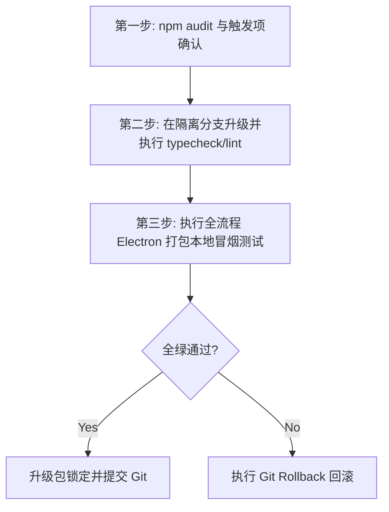

# InkFlow 第三方依赖升级与安全评估报告

本报告针对 InkFlow 桌面协作客户端及服务端底层第三方依赖架构，记录版本事实、漏洞状态、升级可行性和回滚要求。版本与审计结果以当前 `package.json`、`package-lock.json` 和 `npm audit --omit=dev` 为准。

---

## 1. 核心依赖版图与升级策略归类

当前核心依赖已分为以下三大矩阵：**安全可直升 (Patch/Minor)**、**需严密验证 (Major 升舱)** 以及 **暂不动 (Keep Stable)**。

### 📊 升级决策矩阵一览

| 依赖包 (Package) | 当前版本 (Current) | 推荐目标版本 (Target) | 决策归类 (Class) | 升级影响与潜在风险评估 (Impact & Risk) |
| :--- | :--- | :--- | :--- | :--- |
| `better-sqlite3` | `^12.9.0` | `12.x` 最新 Patch | **暂不动** | **高风险**：涉及 Electron Native C++ 原生模块 Node-API 重新编译。Major 升级或不当 Patch 会导致 `better-sqlite3.node` 与 Electron 运行时 ABI 不匹配引起崩溃。 |
| `electron` | `^43.0.0` | `43.x` 最新受支持 Patch | **本机已验证** | **中风险**：macOS arm64 package 与 packaged-editor smoke 已通过；其他目标平台仍需单独验证。 |
| `vite` | `^6.4.3` | `6.x` 最新受支持 Patch | **已验证** | **低风险**：typecheck、build 和 Playwright 已通过。 |
| `tailwindcss` | `^4.1.14` | `^4.2.x` | **安全可直升** | **低风险**：Tailwind CSS v4 在打包和解析 CSS AST 性能上有显著优化，直升不影响现有 CSS 类名渲染。 |
| `@google/genai` | `^1.29.0` | `^1.x` 最新 Minor | **安全可直升** | **中风险**：由于涉及 Gemini-2.5 官方原生 API 通信，应保持 Minor 更新以同步官方 Quota、Thinking 节点优化与流式响应格式微调。 |
| `@xenova/transformers` | `2.17.2` | `2.17.2` | **暂不动** | 已锁定当前 2.x 版本线；需持续验证本地 embedding fallback，不在本轮做 major 迁移。 |
| `sharp` | `0.35.3` | `0.35.3` | **本机已验证** | 通过 override 固定版本；Node/Electron native probe、macOS arm64 package 与 lifecycle smoke 已通过。 |
| `react` / `react-dom` | `^19.0.1` | `19.0.x` / `19.x` | **暂不动** | **极高风险**：目前已处于最新的 React 19.x，底层 `useEditorRecommendationCards` 与 EditorView 渲染完全贴合 React 19 新并发架构，暂无再次跨代升级需要。 |
| `@radix-ui/*` 组件群 | `^1.x` | `^1.x` 最新 Minor | **暂不动** | **中风险**：Radix Primitives 的无样式交互状态（如 Alert-Dialog, Scroll-Area, Tabs, Tooltip）已与 CSS 主体深度绑定。升级大版本有可能破坏 React 19 的 refs 兼容。 |

---

## 2. 深度架构评估与安全门禁

### 当前审计状态（2026-08-09）

已通过 overrides/lockfile 更新修复 `body-parser`、`nanoid`、`postcss` 和 `protobufjs` 的可安全升级路径。当前 `@xenova/transformers` 为 `2.17.2`、`sharp` 为 `0.35.3`，`npm audit` 为 **0 vulnerabilities**（生产依赖口径 `--omit=dev`）。`@img/*` 平台包属于 `sharp` 的白名单传递依赖，仅允许与 `sharp 0.35.3` 配套的 lockfile 条目，不单独升级或放宽白名单。2026-08-08 已完成 macOS arm64 Electron package 与 packaged-editor 生命周期验证；Windows/Linux 仍按目标平台单独复核。

### 🛠️ 2.1 Native C++ 原生模块编译陷阱 (better-sqlite3)
- **底层风险描述**：`better-sqlite3` 在运行时并不是纯 JS 代码，而是依赖底层 SQLite 的 C 语言原生编译。在 Electron 桌面打包过程中，必须执行 `electron-rebuilder` 或通过 `npmRebuild: true` 针对 Electron 内置的 V8 引擎 ABI（Application Binary Interface）进行交叉编译。
- **治理决策**：**严禁随意升级 `better-sqlite3` 到可能涉及底层 C 源码重大重构的版本。** 在后续升级中，必须在打包机上运行 `npm run package` 全流，确认是否有 `NODE_MODULE_VERSION` 异常报错，确保断电恢复与数据落盘完整性（对应任务 095）。

### 🔒 2.2 Electron 安全边界与打包体积卡控
- **底线防御规则**：
  - 维持当前 Electron `v43.x` 的高级安全特性（上下文隔离 Context Isolation 默认开启，集成 Preload 机制）。
  - 在升级任何 `devDependencies`（如 `esbuild`, `electron-builder`）时，确保构建脚本 `scripts/package-electron.mjs` 中的 `asar` 打包白名单没有发生物理泄露，防止 `node_modules/better-sqlite3` 等核心二进制被误排除。

### 🎨 2.3 React 19 与 Radix Primitives 的 Ref 传递兼容性
- **Ref 穿透安全性**：React 19 将 `ref` 变为了普通的 prop 传入。然而，老版本的 Radix 依旧依赖 `forwardRef`。
- **升级考量**：在 Radix Primitives 彻底升级其对 React 19 的全量原生支持前，保持其在 `1.x` 版本内微升级，并开启 `npm overrides`，避免 React 19 严苛模式下的 Ref 内存泄漏或类型崩溃。

---

## 3. 下一步依赖安全升级与全量验证计划

依赖升级不作为常规维护动作。只有 `npm audit`、平台 ABI 验证或明确的运行时缺陷触发时，才进入以下**三步走**安全防护流程：



1. **先执行只读审计，不立即更新依赖**：
   ```bash
   npm audit --omit=dev
   ```
   仅当审计命中可达的高危漏洞、平台 ABI 不兼容或明确运行时缺陷时，建立单独升级变更；否则保持当前 lockfile。
2. **执行编译质量门卡控**：
   - 静态类型检查：`npm run typecheck`
   - Lint 硬限制校验：`npm run lint` 和 `npm run lint:any`（当前 explicit-any 预算为 31/35，不得放宽）
3. **交付全量本地测试**：
   - 必须运行 `npm test`、`npm run test:frontend`、`npm run build` 和 `npx playwright test`；当前基线为后端 798、前端 475 个测试。

### 回滚条件

- 若 Electron 打包或 packaged-editor smoke 出现 `NODE_MODULE_VERSION`/native ABI 不匹配、`sharp` 加载失败、`@img/*` 平台包缺失，立即回滚 `package.json`、`package-lock.json` 及对应构建产物。
- 若 typecheck、build、隔离数据库测试或 Playwright 在依赖变更后失败，停止发布并恢复上一组已验证版本；不得只删除单个平台 `@img/*` 条目来绕过错误。
