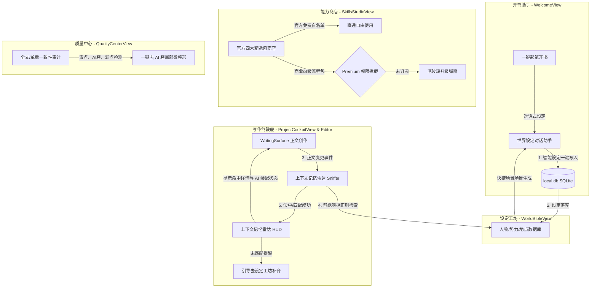

# 墨影 (InkFlow) ── 五大主创作生命生命线板块重塑与高能亮点显性化实施计划 (001-product-deepening-roadmap.md)

为了彻底解决“墨影高能技术长在底层，而用户不知道如何体验和点按”的核心痛点，本计划旨在将墨影的产品交互模型从**“原子功能货架”**重塑为**“长篇小说全创作生命线路径”**。通过将知识图谱、世界观 Agent、Premium 流程商店进行全流式串联，让亮点浮出水面，大幅降低创作者的心智摩擦成本。

本计划stamp commit 为：`77e5e31` (当前 clean 工作区基准)。

---

## 🧭 1. 架构重塑与数据流动模型 (Architecture)

我们将原有的碎片模块（`WelcomeView`, `WorldBibleView`, `SkillsStudioView`, `EditorView`）按照长篇网文写作的 5 个必然生命步骤进行合并、重排，并注入**「上下文记忆雷达」**作为显性技术卖点：



---

## 🛠️ 2. 核心深化板块落地明细 (Specifications)

### 🗺️ 板块 1：开书助手 (WelcomeView.tsx) 与世界观 Agent 联动开书闭环

#### 【修改文件】: [WelcomeView.tsx](file:///Users/Zhuanz/Documents/dodo-inkflow/src/components/WelcomeView.tsx)
#### 【痛点解决】: 创作者开书时脑洞枯竭，不知道如何切入大纲与核心设定。
- **细节设计**:
  - 重构 WelcomeView 顶部的创作动作网格。
  - 当点击“一键脑洞开书”时，不再展示呆板的静态表单，而是呼起一个专门的 **“对话式开书助手”弹窗**。
  - 该弹窗后台复用 `/api/inspiration` 或 `/api/editor-agent` 接口，用户只需输入：*“我想写一本克苏鲁题材的网文，主角是调查员，反派是邪神教主”*。
  - AI 自动生成包含 **“主角名字与背景、反派名字、世界观核心设定、首章切入大纲”** 的确认单。
  - **物理闭环**: 用户点击“一键生成新书”，前端通过 `world-client.ts` 自动调用 `createCharacter` 和 `createLocation`，将生成的人物（主角、反派）和克苏鲁势力设定**瞬间落库**，紧接着跳转到写作驾驶舱，实现“写书即在设定中”的极致闭环。

```typescript
// 伪代码示例：在 WelcomeView.tsx 中开书并自动落入设定
const handleConversationBookSuccess = async (generatedData: any) => {
  // 1. 创建新书
  const novel = await createNovel({
    title: generatedData.title,
    genre: generatedData.genre,
    outline: generatedData.outline
  });
  
  // 2. 将生成的人物/设定自动物理写库 (Bible Data Pre-population)
  await worldClient.createCharacter({
    novelId: novel.id,
    name: generatedData.mainCharacter.name,
    avatar: '👤',
    description: generatedData.mainCharacter.description,
    faction: generatedData.mainCharacter.faction
  });
  
  // 3. 跳转至驾驶舱并携带状态
  onNavigate('workspace');
};
```

---

### 🔮 板块 2：设定工坊 (WorldBibleView.tsx) 的高密提炼

#### 【修改文件】: [WorldBibleView.tsx](file:///Users/Zhuanz/Documents/dodo-inkflow/src/components/WorldBibleView.tsx)
#### 【痛点解决】: 设定模块像一个信息填写后台，缺乏“创作现场感”和“一键生成体系能力”。
- **细节设计**:
  - 将 AI 设定对话助手（Bible Agent Helper）作为左侧/右侧常驻的“设定孵化器”。
  - 提供三大一键孵化快捷场景（场景卡）：
    1. **「网文顶流高爽度力量体系演化仪」**（如：修仙境界、魔法阶层）。
    2. **「大事件/势力关系链推演盘」**。
    3. **「黄金配角/宿命死敌量产器」**。
  - 产出设定采用 **HSL/OKLCH 亮色边框和 monospace 的代码字体数据框** 进行卡片包装，提供“一键植入设定集”按钮，让设定集的建立过程极具游戏合成般的获得感。

---

### 🛰️ 板块 3：写作驾驶舱 (WritingSurface.tsx) ── 「上下文记忆雷达（知识图谱）」显性化

#### 【修改文件】: [WritingSurface.tsx](file:///Users/Zhuanz/Documents/dodo-inkflow/src/components/WritingSurface.tsx)
#### 【痛点解决】: 知识图谱功能常年“藏”在子页里，用户看不见 AI 究竟在如何记忆自己的世界观，产生信任断层。
- **细节设计**:
  - 在 `WritingSurface.tsx` 的右侧辅助面板（原本放置世界观上下文的区域），全面重塑为 **「智能上下文记忆雷达 (Context Memory Radar HUD)」**。
  - **Sniffer (静默嗅探器) 机制**:
    - 前端在 `Editor` 文本变化（`onChange`）事件中加入 800ms 的 `debounce`（节流防抖）。
    - 提取当前正文最新的文本块，通过极快的本地正则或关键词匹配（匹配当前小说落库的 Character、Location、Item 数组名称）。
  - **HUD 视觉呈现**:
    - 如果匹配成功（例如匹配到了“黑羽”、“黑水宗”），雷达区域会浮现微亮绿色光点，高密展示命中卡片：
      `[🛰️ 记忆雷达: 命中设定 2 项 | AI 装配已同步]`
      - `[角色] 黑羽 ── 势力: 黑水宗 (战力: 100, 性阴暗)`
      - `[地点] 黑水宗 ── 状态: 活跃 (神秘暗流)`
    - 如果匹配度为 0（如写了 1000 字没有命中任何设定），雷达温和显示黄色状态：
      `[🛰️ 记忆雷达: 建议丰富设定背景，点此一键为本章主角 [黑羽] 创建仇敌或势力 [设定工坊]`。
    - 这一机制直接让墨影引以为傲的“上下文长效记忆”彻底显性化，带给创作者强烈的心理底气。

```typescript
// 伪代码示例：在 WritingSurface.tsx 中做节流嗅探并更新雷达状态
const useBibleSniffer = (content: string, characters: Character[], locations: Location[]) => {
  const [activeMatches, setActiveMatches] = useState<any[]>([]);

  useEffect(() => {
    const timer = setTimeout(() => {
      if (!content) return;
      const matchedChars = characters.filter(c => content.includes(c.name));
      const matchedLocs = locations.filter(l => content.includes(l.name));
      setActiveMatches([...matchedChars, ...matchedLocs]);
    }, 800); // 800ms debounce
    return () => clearTimeout(timer);
  }, [content, characters, locations]);

  return activeMatches;
};
```

---

### 🏪 板块 4：能力商店 (SkillsStudioView.tsx) ── 四黄金包整合与白名单加固

#### 【修改文件】: [SkillsStudioView.tsx](file:///Users/Zhuanz/Documents/dodo-inkflow/src/components/SkillsStudioView.tsx)
#### 【痛点解决】: 之前的能力广场卡片凌乱堆叠，缺乏成套付费流程的商业价值，Premium 判定容易误伤官方免费底线能力。
- **细节设计**:
  - 顶部主导航重排，抛弃原来的单行大 TABS，分类展示为四大黄金包推荐：
    1. **官方免费包 (Official Free Pack)**：去 AI 腔、基础审稿、动作对白增强。
    2. **Premium 平台网文诊断包**（如“番茄完读模型”、“起点节奏检测流”）。
    3. **Premium 名家题材文风包**（如“诡秘克苏鲁诡谲文笔”、“华美古言金句包装”）。
    4. **Premium 拆书融合包**（支持通过导入文本物理生成，并融合成自身写作提示词）。
  - **白名单加固防护 (Premium Boundary Protection)**:
    - 显式声明 `FREE_WHITE_LIST` 常量，将 `de-ai-polish`、`basic-review`、`action-augment` 等官方承诺终身免费的底线能力完美圈定。
    - 保证其任何时候在前端都显示 `[官方免费]`，且点击“直接运行”时**绝对不触发**付费拦截 modal。
    - 对非白名单的高级/Premium 流程包，在 `handleDirectExec` 判定中，若不满足 paid 条件，完美弹出磨砂玻璃（Glassmorphism）质感的升级窗口，对比显示：“普通卡 vs 付费流程包（更完整的创作步骤、毒点一键整容级修复、万字章末勾子深度审计）”。

```typescript
// 免费白名单声明，保护底层不被误伤
export const FREE_WHITE_LIST_SKILLS = [
  'de-ai-polish',      // 去AI机械感
  'basic-review',      // 基础审稿
  'action-augment',    // 肢体动作对白增强
  'opening-inspiration'// 黄金开篇灵感
] as const;

export function isSkillPaidRestricted(skillId: string, isPremiumNovel: boolean): boolean {
  if (FREE_WHITE_LIST_SKILLS.includes(skillId as any)) return false;
  return !isPremiumNovel; // 如果不是 Premium 作品，且不在白名单内，则属于付费受限
}
```

---

### 🩺 板块 5：质量中心 (QualityCenterView.tsx) ── 重塑创作收口闭环

#### 【新建文件】: [QualityCenterView.tsx](file:///Users/Zhuanz/Documents/dodo-inkflow/src/components/QualityCenterView.tsx)
#### 【痛点解决】: 原本的审稿和局部精修零散藏在编辑器中，没有成为“交稿/发书”前的核心仪式感板块。
- **细节设计**:
  - 新建独立的“质量中心”大页面（由原 EditorView 审计抽屉扩展独立而来）。
  - 提供**「长篇发布前一键无痛质检」**看板：
    1. **错别字 & 大路货词汇质检**：一键红线标出，提供“一键整容/去 AI 腔精修”按钮。
    2. **世界设定一致性冲突质检**：依靠后台 `/api/audit` 计算，若发现前文设定黑羽战力是 100，本章写成了 10，直接亮起琥珀色警告，告知“设定冲突风险：黑羽（前文: 100 战力 | 本章: 10 战力）”。
    3. **毒点/伏笔质检**：检索网文主流平台毒点（如虐主、无端降智），给出明晰的安全分数。

---

## 🧭 3. 多 Agent 验证与合并门禁规范 (Verification)

为了保证这一轮多板块、多维度深化的交付质量，合并前必须并发通过严密程度最高的质量守卫（Gatekeeper）流水线检验：

### 1. 静态类型编译器检验
```bash
npm run typecheck
```
* **期望产出**: 0 errors，0 warnings。重点保证由于修改了 Sidebar / ViewType 带来的 props 和 type 关联报错被 100% 物理消除。

### 2. 代码风格与副作用审查
```bash
npm run lint
```
* **期望产出**: 无任何 ESLint 格式退化，确保新引入的「Sniffer 雷达节流监听器」不破坏 React 纯函数纯净规则（如有 Date/副作用计算，必须规范使用 `// eslint-disable-next-line react-hooks/purity` 注释标记）。

### 3. 单元测试套件检验
```bash
npm test
```
* **期望产出**: 确保底层的 173 条元数据长度和 353 个单元测试全绿通过。特别需要为「上下文记忆雷达 sniff」和「付费白名单 `isSkillPaidRestricted`」编写高精度的逻辑断言单元测试，防范未来重塑中功能退化。

### 4. 生产构建打包验证
```bash
npm run build
```
* **期望产出**: 构建成功，无 Chunk 冲突或 Rollup 循环依赖报错。

---

## 🚀 4. 产品演进推进路线图与优先级 (Priority Roadmap)

| 阶段 | 交付板块 / 任务目标 | 核心受众价值 | 优先级 (Priority) |
| :--- | :--- | :--- | :--- |
| **阶段 1** | **能力商店 4 黄金包分类重排 + 免费白名单保护机制** | 清晰划定“免费能写什么、付费包能写什么”，稳固商业边界，不误伤底盘。 | 🔴 **P0 (最紧急)** |
| **阶段 2** | **写作驾驶舱常驻「上下文记忆雷达」命中 HUD 物理落地** | 让长效设定记忆从“后台默默执行”浮现为“写作现场雷达高亮”，创造强烈技术说服力。 | 🔴 **P0 (最紧急)** |
| **阶段 3** | **欢迎页「一键脑洞开书」与「世界观 Agent」对话落库闭环** | 降低开书起笔心智摩擦，实现“写书即在设定中”。 | 🟡 **P1 (高度重要)** |
| **阶段 4** | **设定工坊三大快捷孵化场景重塑 (WorldBibleView 面板升级)** | 提供境界演化、大事件推演、仇敌量产，大幅提升设定模块的获得感。 | 🟡 **P1 (高度重要)** |
| **阶段 5** | **质量中心独立控制台 (QualityCenterView) 物理总装** | 将去 AI、毒点检测、设定冲突打造成发书前的核心质检仪式感。 | 🟢 **P2 (后续补强)** |
