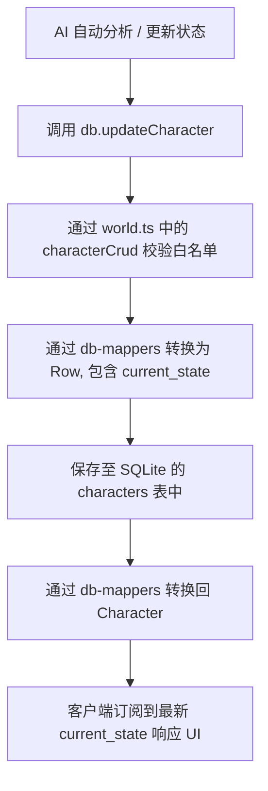

# 095: 修复角色状态自动更新落盘

## 1. 目标描述 (Goal Description)
当前系统中虽然在前端和类型声明里定义了角色的 `current_state?: string`，且有 `/api/update-character-state` 或通过 `db.updateCharacter` 更新该字段，但由于 SQLite 数据库对应的 `characters` 表在物理上没有声明此列、并且角色映射器 (db-mappers) 以及 CRUD 的字段白名单 (db/world.ts) 均未包含此字段，导致更新悄无声息地失败了（数据没有落盘）。

本任务的目标是在保留现有数据库架构及类型的前提下，通过数据库增量改动机制 (`ensureColumn`) 和白名单补全，让角色状态 `current_state` 能够真正持久化落盘。

## 2. 架构方案与安全性审计 (Architecture & Security Audit)

### 2.1 数据库字段扩展安全性
- **无破坏升级**: 避免使用全量数据库 Migration 迁移，复用项目已有的 `ensureColumn` 静默检测和增量表结构升级机制。
- **安全隔离**: `ensureColumn('characters', 'current_state', "TEXT DEFAULT ''")` 执行时，若老用户数据库中已有此列则什么都不做；若没有此列，则会静默执行 `ALTER TABLE characters ADD COLUMN current_state TEXT DEFAULT ''`，对原有数据无任何破坏，提供向后兼容性。

### 2.2 逻辑架构流图


## 3. 具体修改设计 (Proposed Changes)

### 3.1 数据库初始化
#### [MODIFY] [server/lib/db-init.ts](file:///Users/Zhuanz/Documents/dodo-inkflow/server/lib/db-init.ts)
- 在 `CREATE TABLE IF NOT EXISTS characters` 建表语句中，在 `bio TEXT DEFAULT '',` 下方补充物理列 `current_state TEXT DEFAULT '',`：
  ```sql
  CREATE TABLE IF NOT EXISTS characters (
    id TEXT PRIMARY KEY,
    novel_id TEXT NOT NULL,
    name TEXT NOT NULL,
    role TEXT DEFAULT 'supporting',
    summary TEXT DEFAULT '',
    traits TEXT DEFAULT '[]',
    bio TEXT DEFAULT '',
    current_state TEXT DEFAULT '',
    created_at INTEGER NOT NULL,
    updated_at INTEGER NOT NULL,
    FOREIGN KEY (novel_id) REFERENCES novels(id) ON DELETE CASCADE
  );
  ```
- 在 `initDb` 函数末尾的 `ensureColumn` 区域中（在 `repairImportedContinuationPackNovelLinks()` 之前）追加增量列升级语句：
  ```typescript
  ensureColumn('characters', 'current_state', "TEXT DEFAULT ''");
  ```

### 3.2 序列化与反序列化
#### [MODIFY] [server/lib/db-mappers.ts](file:///Users/Zhuanz/Documents/dodo-inkflow/server/lib/db-mappers.ts)
- 补全 `rowToCharacter(row: DbRow): Character` 的属性映射：
  ```typescript
  export function rowToCharacter(row: DbRow): Character {
    return {
      ...row,
      novelId: row.novel_id,
      traits: JSON.parse(row.traits || '[]'),
      current_state: row.current_state || '',
      createdAt: row.created_at,
      updatedAt: row.updated_at,
    };
  }
  ```
- 补全 `characterToRow(c: Character): DbRow` 的属性映射：
  ```typescript
  export function characterToRow(c: Character): DbRow {
    return {
      id: c.id,
      novel_id: c.novelId,
      name: c.name,
      role: c.role,
      summary: c.summary,
      traits: JSON.stringify(c.traits || []),
      bio: c.bio,
      current_state: c.current_state || '',
      created_at: c.createdAt,
      updated_at: c.updatedAt,
    };
  }
  ```

### 3.3 CRUD 白名单
#### [MODIFY] [server/lib/db/world.ts](file:///Users/Zhuanz/Documents/dodo-inkflow/server/lib/db/world.ts)
- 为 `characterCrud` 的 `insertColumns` 和 `updateColumns` 补足 `current_state`：
  ```typescript
  const characterCrud = createCrudHelpers<Character, ReturnType<typeof characterToRow>>({
    tableName: 'characters',
    rowToEntity: rowToCharacter,
    entityToRow: characterToRow,
    insertColumns: ['id', 'novel_id', 'name', 'role', 'summary', 'traits', 'bio', 'current_state', 'created_at', 'updated_at'],
    updateColumns: ['novel_id', 'name', 'role', 'summary', 'traits', 'bio', 'current_state', 'updated_at'],
    listFilterKey: 'novel_id'
  });
  ```

## 4. 验证设计 (Verification Plan)

### 4.1 自动化测试
新建 [tests/db-character-state.test.ts](file:///Users/Zhuanz/Documents/dodo-inkflow/tests/db-character-state.test.ts)，使用 `node:test` 做隔离的数据库持久化和多周期读写测试：
- 创建 Novel 与 Character（传入初始 `current_state`）。
- 验证 `getCharacter` 能取回正确的 `current_state`。
- 调用 `updateCharacter` 修改 `current_state` 并验证。
- 模拟进程退出：调用 `closeDb()` 物理关闭连接，随后用相同 dbPath 再次 `initDb()`。
- 再次读取该 Character，验证 `current_state` 正确性，确保数据写入磁盘。

### 4.2 运行指令
```bash
npm run test
```
