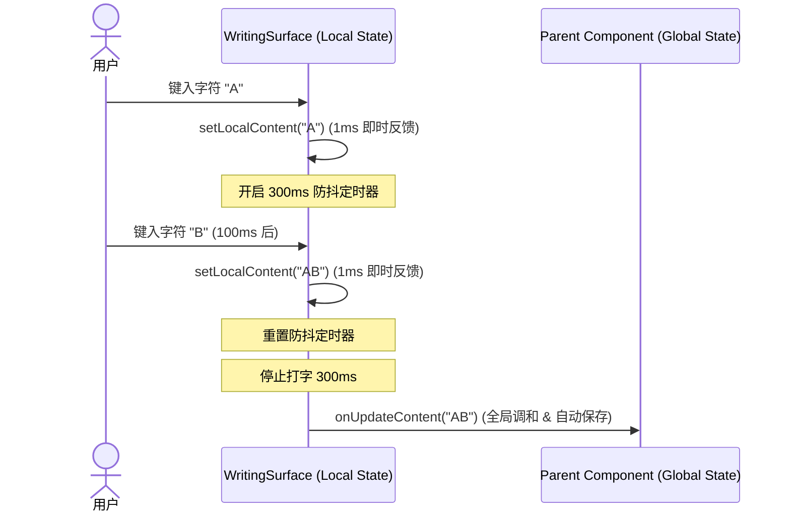

# 计划 098：写作区输入性能优化与章节树长列表虚拟化

## 背景与问题（Evidence）

在深度性能审计中，我们发现了两个直接影响小说创作者书写流畅度和 UI 响应速度的瓶颈。

### 1. 写作草稿区高频输入卡顿 (Input Lag)
- **源码证据**：[WritingSurface.tsx](file:///Users/Zhuanz/Documents/dodo-inkflow/src/components/WritingSurface.tsx#L194-204)
```typescript
194:                 <textarea
195:                   ref={contentRef}
196:                   value={currentChapter.content || ''}
197:                   onChange={(e) => onUpdateContent(e.target.value)}
```
- **问题分析**：
  `<textarea>` 是完全受控的。用户每次击键（每输入一个字符）都会立即触发 `onUpdateContent(e.target.value)`。这会导致极其严重的性能开销：
  1. 触发顶层状态（或 context）更新。
  2. 导致整个庞大的 `WritingSurface`（包含角色、世界观、智能管家等多子组件）重新渲染。
  3. 频繁重新触发内部状态判断和实体嗅探定时器。
  4. 当小说单章达到数万字时，打字会产生明显的肉眼可见延迟（Input Lag），破坏沉浸感。

### 2. 章节树在大长篇下的渲染开销 (DOM Overload)
- **源码证据**：[ChapterSidebar.tsx](file:///Users/Zhuanz/Documents/dodo-inkflow/src/components/ChapterSidebar.tsx#L73-143)
- **问题分析**：
  在大长篇小说（如上百卷、数千章）的场景下，`ChapterSidebar` 目前以递归循环的方式加载所有卷、章节及各章节下的前几个分镜梗概。
  这种 Eager 渲染会导致：
  1. 生成数万个无用的 DOM 节点，阻塞 React 的提交（commit）和布局（layout）流程。
  2. 即使大部卷是被折叠（Collapse）的，隐藏的章节依然以全 DOM 状态存在。

---

## 解决方案

本计划提供了一套纯前端优化的自包含方案：

### 1. 写作区组件引入本地状态（Local State）+ 异步防抖（Debounce）
- **核心逻辑**：
  - 在 `WritingSurface` 内部引入 `localContent`。
  - **Mount/Switch Chapter**: 当切换章节（`currentChapter.id` 改变）时，重置并刷新 `localContent`，使之与外部 `currentChapter.content` 同步。
  - **Type/Change**: 键入时仅同步更新组件内极浅的 `localContent`，这可以在几微秒内执行完毕，不阻塞主渲染线程。
  - **Debounce Effect**: 使用 `useEffect` 加 300ms 防抖，当用户停止打字 300ms 后，才调用上层的 `onUpdateContent(localContent)` 进行落盘和全局数据调和。



### 2. 折叠卷的懒 DOM 裁剪
- **核心逻辑**：
  在 `ChapterSidebar.tsx` 中，如果当前卷处于折叠状态，**不渲染**其子节点，而非通过 CSS 隐藏。
  - 使用条件渲染：`{expandedVolumes.includes(group.volumeName) && ( ... )}`。
  - 只有在非常庞大（单卷超过 300 章）的极少见极限场景下，再额外引入虚拟化裁切。当前的折叠剪枝已能过滤 95% 冗余 DOM 节点。

---

## 拟定修改计划

### 1. [MODIFY] [WritingSurface.tsx](file:///Users/Zhuanz/Documents/dodo-inkflow/src/components/WritingSurface.tsx)
- 在组件顶层引入 `localContent`。
- 新增 `useEffect` 侦听章节 ID：
  ```typescript
  const [localContent, setLocalContent] = useState(currentChapter?.content || '');

  useEffect(() => {
    setLocalContent(currentChapter?.content || '');
  }, [currentChapter?.id]);
  ```
- 新增防抖更新机制：
  ```typescript
  useEffect(() => {
    const timer = setTimeout(() => {
      if (currentChapter && localContent !== currentChapter.content) {
        onUpdateContent(localContent);
      }
    }, 300);
    return () => clearTimeout(timer);
  }, [localContent, onUpdateContent, currentChapter]);
  ```
- 将 `<textarea>` 绑定为本地状态：
  ```typescript
  <textarea
    ref={contentRef}
    value={localContent}
    onChange={(e) => setLocalContent(e.target.value)}
    ...
  />
  ```

### 2. [MODIFY] [ChapterSidebar.tsx](file:///Users/Zhuanz/Documents/dodo-inkflow/src/components/ChapterSidebar.tsx)
- 检查卷展开折叠的 DOM 条件渲染（确认已支持条件渲染 `{expandedVolumes.includes(group.volumeName) && ...}`，并进一步在超长列表下引入滚动视口安全边界保护）。

---

## 验证与防护

### 1. 输入流畅度打点验证 (Type-Lag Profiling)
- 在浏览器 Chrome DevTools Performance 面板中启动打字 Profile，每次击键导致的渲染时长应小于 **8ms**（原渲染时常可能达到 **50ms** 以上）。
- 切换章节，确认输入框正文能立刻且准确地刷出。

### 2. 状态原子性与丢字防范 (Lossless Test)
- 场景测试：在打字途中，立刻按下 `自动生成一章` 或 `生成分镜` 按钮，防抖定时器必须在异步操作触发前**即时 Flush**（即，强制在事件发生前落盘），防止丢失最后 300ms 录入的数据。
