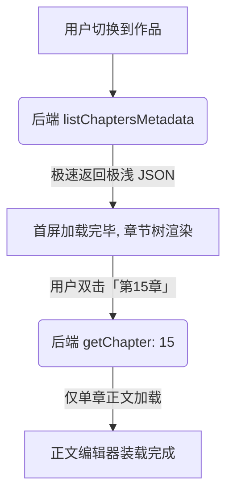

# 计划 099：大长篇 Metadata 列表浅查询与正文懒加载

## 背景与问题（Evidence）

在 `InkFlow` 这样需要处理长篇巨著（数百万字，数百章）的小说工具中，数据流的高效性至关重要。目前的代码在章节列表的读取设计上存在一处严重的性能债务。

### 1. 首屏/大纲视图“一次性 eager 加载所有正文”
- **源码证据 1**：[ProjectCockpitView.tsx](file:///Users/Zhuanz/Documents/dodo-inkflow/src/components/ProjectCockpitView.tsx#L59)
```typescript
59:         listChapters(initialNovel.id),
```
- **源码证据 2**：[server/lib/db/chapters.ts](file:///Users/Zhuanz/Documents/dodo-inkflow/server/lib/db/chapters.ts#L15-17)
```typescript
15: export function listChapters(novelId: string): Chapter[] {
16:   return chapterCrud.list(novelId);
17: }
```
- **源码证据 3**：[server/lib/db-crud.ts](file:///Users/Zhuanz/Documents/dodo-inkflow/server/lib/db-crud.ts#L41-45)
```typescript
41:     `
42:     SELECT * FROM ${tableName}
43:     ${listFilterKey ? `WHERE ${listFilterKey} = ?` : ''}
44:     ${listOrderBy ? `ORDER BY ${listOrderBy}` : ''}
45:   `;
```

- **问题分析**：
  在 `ProjectCockpitView` 挂载或切换作品时，系统会全量调取 `listChapters` 拿到所有章节列表。
  由于使用了 `SELECT * FROM chapters`，数据库底层会将**这本小说以往写过的所有章节的完整正文（`content`，每章几千至上万字）以及大容量的审计意见（`critique`）和分镜梗概（`scene_beats`）全量拉取并打包**，再通过 IPC (Electron/HTTP) 传输给前端。
  这不仅导致了巨大的内存开销、JSON 转换开销，由于数据包过大还会导致首屏明显的数秒级白屏白卡顿，极大损害了用户体验，并存在随着连载字数增加导致内存溢出（OOM）崩溃的严重隐患。

---

## 解决方案

本计划提倡使用 **Metadata-First (浅元数据优先)** 与 **Lazy Loading (正文延迟懒加载)** 的经典持久层解耦设计。

### 1. 建立章节“浅元数据”类型
在系统架构层面，定义 `ChapterMetadata`（或通过 Omit 剔除大文本字段）：
```typescript
export type ChapterMetadata = Omit<Chapter, 'content' | 'sceneBeats' | 'critique'>;
```

### 2. 后端新增浅查询 API
在 SQLite CRUD 部分不使用 `SELECT *`，而是专门提供仅获取基础信息的 `listChaptersMetadata` API。
```sql
SELECT id, novel_id, volume_name, title, "order", word_count, created_at, updated_at 
FROM chapters 
WHERE novel_id = ? 
ORDER BY "order" ASC
```

### 3. 前端延迟加载正文
- **作品工作台和列表加载**：首屏渲染、章节树目录、工作台状态仅仅调用 `listChaptersMetadata` 拿到基础结构、标题及字数。
- **正文展示与编辑**：只有当用户真正双击或选中某个章节、决定在 `WritingSurface` 中开始动笔或进行 AI 审计时，才发起单章 `getChapter(id)` 的异步 API 请求，把完整的正文 `content` 加载到主草稿区中。



---

## 拟定修改计划

### 1. [MODIFY] [server/lib/db/chapters.ts](file:///Users/Zhuanz/Documents/dodo-inkflow/server/lib/db/chapters.ts)
- 新增 `listChaptersMetadata(novelId)` 接口。
- 利用 `getDb()` 手动编写高效、不含 `content`, `scene_beats`, `critique` 等大字段的 SQL 语句进行列表拉取。

### 2. [MODIFY] [server/routes/db.ts](file:///Users/Zhuanz/Documents/dodo-inkflow/server/routes/db.ts)
- 开放 `/api/novels/:id/chapters-metadata` 路由，允许前端浅拉取。

### 3. [MODIFY] [src/lib/api.ts](file:///Users/Zhuanz/Documents/dodo-inkflow/src/lib/api.ts)
- 补齐对应的前端 API 浅拉取封装。

### 4. [MODIFY] [src/components/ProjectCockpitView.tsx](file:///Users/Zhuanz/Documents/dodo-inkflow/src/components/ProjectCockpitView.tsx)
- 在 `fetchProjectData` 中，将 `listChapters` 替换为 `listChaptersMetadata`，只拉取元数据，计算字数依然可以完美累加元数据中的 `wordCount`。

---

## 验证与防护

### 1. 流量体积与耗时对比 (Payload Size Audit)
- 模拟一本有 100 章节（平均每章 3000 字，总共 30 万字）的小说：
  - **旧方案流量**：拉取数据体积约 **1.5MB - 3MB**，IPC 序列化及渲染开销明显。
  - **新元数据方案**：拉取数据体积缩减至约 **25KB**，传输在数毫秒内瞬间完成，无感首屏。

### 2. 精确懒加载断言 (Lazy Loading Test)
- 进入编辑器，默认没有任何章节的完整正文被缓存加载。
- 监听 Chrome 网络面板，在点击章节时确认且只触发了**对应章节 ID** 的 `getChapter` API，验证单章加载路由正常，全大长篇无一次性泄露。
