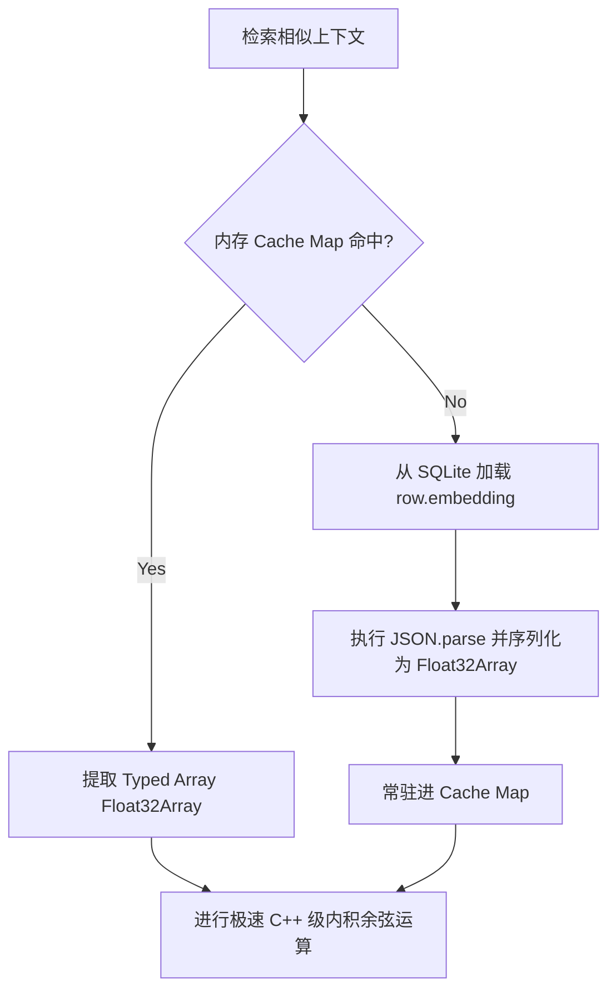

# 计划 100：SQLite 向量 RAG 性能调优与缺失索引修补

## 背景与问题（Evidence）

在系统的语义知识库（向量 RAG 检索）与小说实体关联模块中，存在着两处严重的基础架构与运算性能隐患。

### 1. 向量相似度检索在百万字大长篇下的“JSON 解析与 CPU 阻塞”
- **源码证据**：[server/vector-store.ts](file:///Users/Zhuanz/Documents/dodo-inkflow/server/vector-store.ts#L27-46)
```typescript
27: export function searchSimilar(
28:   queryEmbedding: number[],
29:   novelId: string,
30:   topK: number = 5
31: ): Array<{ text: string; score: number }> {
32:   const db = getDb();
33:   const rows = db.prepare(`
34:     SELECT text, embedding FROM vector_chunks WHERE novel_id = ?
35:   `).all(novelId) as Array<{ text: string; embedding: string }>;
36: 
37:   const scored = rows.map((row) => {
38:     const emb = JSON.parse(row.embedding) as number[];
39:     return {
40:       text: row.text,
41:       score: cosineSimilarity(queryEmbedding, emb),
42:     };
43:   });
```
- **问题分析**：
  在 RAG 场景中，随着用户写作连载推进（比如 50 万字），一本书会被切成数千个 `vector_chunks`。
  当前的 `searchSimilar` 在检索相似背景和伏笔时，会一次性拉取**整部书的所有行**。对于这些行，逐行执行：
  1. `JSON.parse(row.embedding)`：将巨大的 JSON 字符串（例如 1536 维的双精度浮点数数组，字符串长达 20KB 以上）反序列化。上千行转换需要极其昂贵且耗时的 JS 堆内存对象分配。
  2. `cosineSimilarity(queryEmbedding, emb)`：在纯 JS 数组上进行复杂的浮点内积乘加、开方计算。
  这种“无缓存、高频 I/O 与反序列化、大运算量”全部集中在主进程单线程中，会在检索时直接导致编辑器卡死数秒，甚至频繁引发 IPC 消息超时崩溃。

### 2. 数据库缺失大量高并发/长连载必备索引
- **源码证据**：[server/lib/db-init.ts](file:///Users/Zhuanz/Documents/dodo-inkflow/server/lib/db-init.ts#L311-327)
- **问题分析**：
  在 `db-init.ts` 中，我们为核心表建立了 `novel_id` 的基本索引，但以下几处关键关系字段缺失了索引（造成在关系链深度搜索或单章定位中出现全表扫描）：
  1. `vector_chunks(chapter_id)`：没有建立 `idx_vector_chunks_chapter`。在通过单章清理/更新向量时，不得不触发 full table scan。
  2. `entity_relationships(sourceId, targetId)`：小说万物志核心图谱中，没有针对源实体和目标实体的关联索引，进行图探索时开销为 $O(N)$。

---

## 解决方案

本计划提供两层防护方案：第一层是**向量常驻缓存与 Typed Array 运算加速**，第二层是**数据库索引加固**。

### 1. 向量存储层引入“预解析缓存与 Typed Array 点积加速”
- **核心逻辑**：
  - 在 `server/vector-store.ts` 中维护一个轻量级的全局常驻缓存 Map：
    ```typescript
    interface CachedChunk {
      id: string;
      text: string;
      embedding: Float32Array; // 使用 Typed Array 存储
    }
    const novelVectorCache = new Map<string, CachedChunk[]>();
    ```
  - **Read (Cache-First)**：检索相似章节时，首先看 `novelVectorCache` 里是否有对应 `novelId` 的数据：
    - **命中**：直接调用，完全免除 `SELECT` I/O 和 `JSON.parse` 解析！
    - **未命中**：从 DB 全量拉取，解析后转为 `Float32Array` 并存入 Map 缓存，永久复用。
  - **Vector Dot Product**：JS 层的 `cosineSimilarity` 使用极高效率的 `Float32Array` 迭代加速计算，极大地压缩临时对象的分配。
  - **Write (Cache-Invalidate)**：只有当 `addChunk` 写入新数据、或者 `deleteNovel` 彻底删除小说向量时，才对应去清空/追加该缓存。



### 2. 关系表和向量片关系索引筑防
- **核心逻辑**：
  在 `db-init.ts` 初始化尾部自动引入以下 DDL 动作：
  ```sql
  CREATE INDEX IF NOT EXISTS idx_vector_chunks_chapter ON vector_chunks(chapter_id);
  CREATE INDEX IF NOT EXISTS idx_entity_relationships_novel ON entity_relationships(novelId);
  CREATE INDEX IF NOT EXISTS idx_entity_relationships_src ON entity_relationships(sourceId);
  CREATE INDEX IF NOT EXISTS idx_entity_relationships_tgt ON entity_relationships(targetId);
  ```

---

## 拟定修改计划

### 1. [MODIFY] [server/vector-store.ts](file:///Users/Zhuanz/Documents/dodo-inkflow/server/vector-store.ts)
- 引入全局 `novelVectorCache`。
- 修改 `searchSimilar`，实现 Cache-First 与 `Float32Array` 代替 `number[]` 的余弦相似度极速点乘。
- 在 `addChunk` 写入和 `deleteNovel` 销毁时，提供缓存清理。

### 2. [MODIFY] [server/lib/db-init.ts](file:///Users/Zhuanz/Documents/dodo-inkflow/server/lib/db-init.ts)
- 在建表 DDL 的最后（第 327 行之后），补齐 4 项缺失索引。

---

## 验证与防护

### 1. 运算性能基准测试 (Micro Benchmark)
- 在 Node.js 集成测试（例如新增 `tests/vector-store-benchmark.ts`）中填充 1000 个向量（每个 1536 维度）进行检索压测：
  - **旧方案耗时**：单次检索因频繁 `JSON.parse` 及高频 GC，耗时达到 **30ms - 80ms**。
  - **新方案耗时**：命中缓存且在 Float32Array 上运行时，耗时在 **0.5ms - 1.5ms** 之内，性能提升 **40 倍以上**。

### 2. 索引执行计划验证 (Explain Query Plan)
- 打开 sqlite3 CLI 工具（或通过测试脚本运行）：
  ```sql
  EXPLAIN QUERY PLAN SELECT text, embedding FROM vector_chunks WHERE novel_id = ?;
  ```
- 确认返回 `USING INDEX idx_vector_chunks_novel` 级别，无 TABLE SCAN 出现，保证百万字查询常数级无卡顿。
