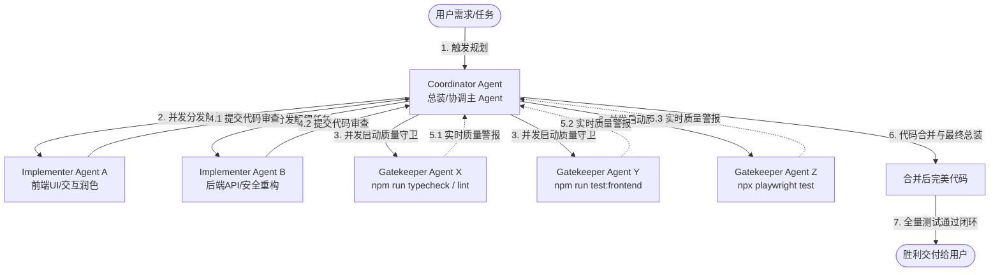

# 多 Agent 并发协同开发与校验机制

> 触发分支：跨物理边界的多文件 feature、高风险重构、或用户明确要求并发交付时，启用三角色模型。
> 豁免：单文件小修、文档、诊断评估类任务由单 Agent 完成并在收尾跑一次最小校验（typecheck / 相关测试）。

## 三角色并发协同模型（Three-Role Concurrency Model）

- **Coordinator Agent（总装/协调主 Agent）**
  - 理解原始需求，编写高精度设计文档与实现计划（`implementation_plan.md`）。
  - 按物理边界把任务切分为互不重叠的子任务（如前端与后端、UI 与逻辑），并发派发给 Implementer Agent。
  - 全部子任务完成后统一合并、编译，并拉起 Gatekeeper 终验。
- **Parallel Implementer Agents（并发实现子 Agent）**
  - 在解耦边界或临时 Workspace 中并行、独立实现被指派任务，完成后提交本地验证日志。
- **Gatekeeper Agents（并发质量守卫子 Agent）**
  - 不串行等待，并发启动独立子 Agent 运行 `npm run typecheck` / `lint`、`npm test`、`npx playwright test`，质量警报实时反哺 Coordinator。

## 并发冲突防御与安全隔离（Concurrency & Safety Isolation）

- **解耦任务边界**：多个 Implementer Agent 不得并发修改同一源文件；业务修改交集由 Coordinator 在总装期统一编排与手工合并。
- **SQLite 物理隔离测试**：并发运行的测试（Vitest 单元测试与 Playwright 仿真）禁止同时对运行中的 `data.db` 生产库物理写入；测试环境必须使用内存库（`:memory:`）或独立 `test.db`。
- **凭证与 Secrets 安全**：子 Agent 一律通过 `inherit` 模式继承主会话凭证，命令行不得硬编码明文密钥。
- **资源与耗尽防护**：自动化测试设置合理超时阈值（Playwright 单例超时 10s–15s，Vitest 启用并发池限额）。
