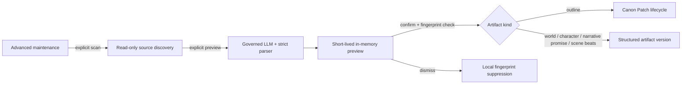

# Legacy Artifact Structuring Design

## Status

Accepted for Task 14. The user authorized execution of all remaining plan tasks with a bounded completion rule.

## Requirements

- Opening a project must not call a model or write data.
- Discovery is read-only and starts only after an explicit advanced-maintenance action.
- Preview preserves the source text and creates no persisted candidate or active version.
- Parser/model failure leaves every source and active structured version unchanged.
- Confirmation revalidates database generation and the current source fingerprint before writing.
- Dismissal suppresses only the current source fingerprint; changed source text can be offered again.
- World text, character Bio, outline text, scene beats, and foreshadowing rows are supported.

## Decision

Use one UI/API preview contract with domain-owned confirmation adapters.

The common source descriptor contains novel ID, artifact kind, artifact ID, label, current structured version, source fingerprint, and original readable content. Preview tokens are process-local, bounded, and disposable; a missing or expired token requires a new preview.

## Ownership Adapters

- `world`: source is the novel world text; confirmation saves a `world` structured version with original text as readable content.
- `character`: source is Character Bio; confirmation saves a `character` structured version without rewriting Bio.
- `master-outline`, `volume-outline`, `chapter-outline`: source is the active outline row; confirmation creates and accepts a Canon Patch so `outline_artifacts` remains authoritative.
- `narrative-promise`: source is the foreshadowing row; confirmation saves a narrative-promise structured version without rewriting compatibility fields.
- `scene-beats`: source is the chapter scene-beats text; confirmation saves a scene-beats structured version while preserving chapter text as readable content.

## Prompt Contract

The prompt must require JSON only, preserve explicit source facts, prohibit invented facts, identify the artifact kind, and return the kind-specific structured root. Parsing and normalization happen before a preview token is issued.

## Failure Modes

- Unknown/foreign artifact: 404, no model call.
- Empty or already structured source: omitted from discovery.
- Invalid model JSON or empty normalized core: 422, no preview and no write.
- Expired preview, stale generation, or changed source fingerprint: 409, no write.
- Domain confirmation failure: transaction rolls back and the original remains active.

## Alternatives Considered

- One generic candidate table for every kind: rejected because outlines and production artifacts have different owners and consumers.
- Persist preview candidates immediately: rejected because the plan requires a read-only preview and no background migration writes.
- Separate UI per artifact page: deferred because one advanced-maintenance entry satisfies reachability with less duplication.

## Completion Boundary

Task 14 stops when the five source families are discoverable, preview/confirm/dismiss behavior is covered, the advanced entry is reachable, and focused tests, typecheck, target lint, and diff-check pass. No bulk migration, background scan, lifecycle refactor, or visual polish is included.
